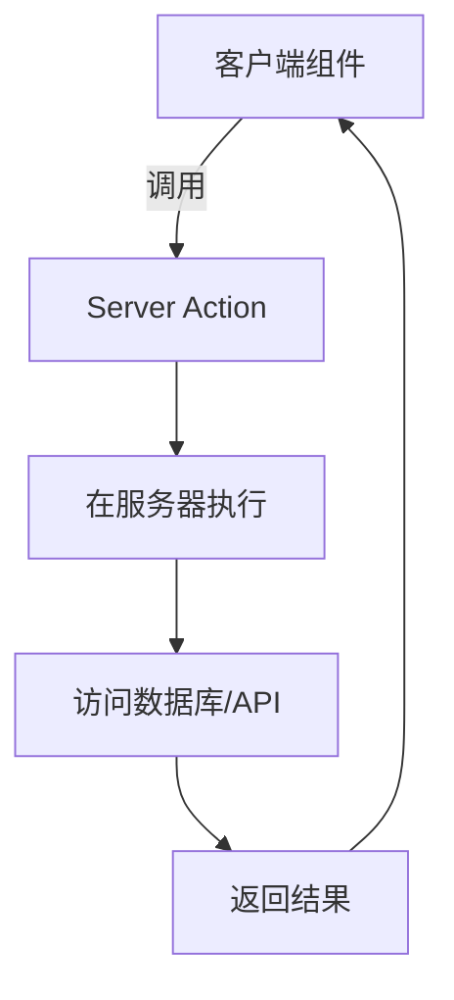
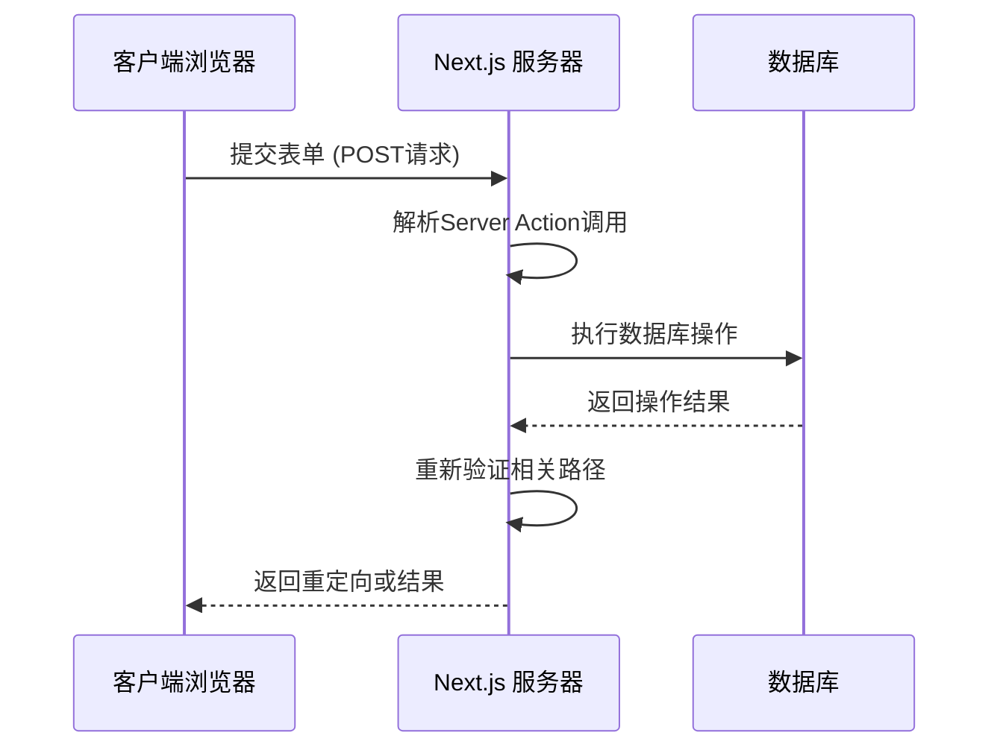

- Next.js 优先推荐使用原生的 fetch 方法，因为 Next.js 拓展了原生的 fetch 方法，为其添加了缓存和更新缓存(重新验证)的机制。

## 1. 基本用法

Next.js 拓展了原生的 [fetch Web API](https://developer.mozilla.org/zh-CN/docs/Web/API/Fetch_API)，可以为**服务端的每个请求**配置缓存（caching）和重新验证（ revalidating）行为。

+ **默认缓存**：默认情况下，Next.js 会自动缓存服务端 `fetch` 请求的返回值

```js
// fetch 的 cache 选项用于控制该请求的缓存行为
// 默认就是 'force-cache', 平时写的时候可以省略
fetch('https://...', { cache: 'force-cache' })
```

但这些情况默认不会自动缓存：

1. 在 Server Action 中使用的时候
2. 在定义了非 GET 方法的路由处理程序中使用的时候

**简单的来说，在服务端组件和只有 GET 方法的路由处理程序中使用 fetch，返回结果会自动缓存。**

+ **logging 配置项**
  + 帮助我们查看缓存情况（不保准）
  + 命中缓存：命令行显示（HIT），命中缓存，返回200
  + cache: SKIP 表示数据发生改变

```js
const nextConfig = {
  logging: {
    fetches: {
      fullUrl: true
    }
  }
};

export default nextConfig;
```

+ **服务器组件**
  + 开发模式下，每次fetch会刷新，但是打包后，会命中缓存
+ **路由处理程序 GET 请求**
  + 同样的开发环境下，路由处理程序处理Get请求，此时请求中使用fetch不会返回缓存
  + 如果打包， fetch 请求的返回结果被缓存了，无论是否硬刷新，接口数据都会保持不变。
  + 特别说明：**实际测试的时候，也并没有使用缓存。**看到打包内容是标记是动态的。所以上面说的情况并不准确
  + API 路由 目前都是始终动态执行

题外话：如何设置API路由是静态、动态（显式控制渲染行为）

1. **强制静态渲染**

   ```js
   export const dynamic = 'force-static'; // 禁用动态行为:cite[1]
   ```

2. **强制动态渲染**

   ```js
   export const dynamic = 'force-dynamic'; // 忽略缓存，始终动态执行:cite[5]
   ```

3. **增量静态再生（ISR）**
   结合静态与动态优势，定时更新缓存：

   ```js
   export const revalidate = 60; // 每60秒重新验证数据:cite[5]
   ```

## 2. 重新验证

**在 Next.js 中，清除数据缓存并重新获取最新数据的过程就叫做重新验证（Revalidation）。**

Next.js 提供了两种方式重新验证：

一种是**基于时间的重新验证（Time-based revalidation）**，即经过一定时间并有新请求产生后重新验证数据，适用于不经常更改且新鲜度不那么重要的数据。

一种是**按需重新验证（On-demand revalidation）**，根据事件手动重新验证数据。按需重新验证又可以使用基于标签（tag-based）和基于路径（path-based）两种方法重新验证数据。适用于需要尽快展示最新数据的场景。

### 2.1 基于时间的重新验证

使用基于时间的重新验证，你需要在使用 fetch 的时候设置 `next.revalidate` 选项（以秒为单位）：

```js
fetch('https://...', { next: { revalidate: 3600 } })
```

或者通过[路由段配置项](https://juejin.cn/book/7307859898316881957/section/7309079033223446554)进行配置，使用这种方法，它会重新验证该路由段所有的 `fetch` 请求。

```js
// layout.jsx | page.jsx | route.js
export const revalidate = 3600
```

注：在一个静态渲染的路由中，如果你有多个请求，每个请求设置了不同的重新验证时间，将会使用最短的时间用于所有的请求。而对于动态渲染的路由，每一个 `fetch`请求都将独立重新验证。

### 2.2 按需重新验证

使用按需重新验证，在**路由处理程序或者 Server Action** 中通过路径（ [revalidatePath](https://juejin.cn/book/7307859898316881957/section/7309079586296791050#heading-12)） 或缓存标签 [revalidateTag](https://juejin.cn/book/7307859898316881957/section/7309079586296791050#heading-23) 实现。

### 2.2.1 revalidatePath 会对对应的路由进行

```js
import { revalidatePath } from 'next/cache'
 
export async function GET(request) {
  const path = request.nextUrl.searchParams.get('path')
 
  if (path) {
    revalidatePath(path)
    return Response.json({ revalidated: true, now: Date.now() })
  }
 
  return Response.json({
    revalidated: false,
    now: Date.now(),
    message: 'Missing path to revalidate',
  })
}
```

### 2.2.2 revalidateTag

使用 fetch 的时候，设置一个或者多个标签标记请求

调用 revalidateTag 方法重新验证该标签对应的所有请求

```js
await fetch('https://...', { next: { tags: ['collection'] } })
```

```js
import { revalidateTag } from 'next/cache'
 
export async function GET(request) {
  const tag = request.nextUrl.searchParams.get('tag')
  revalidateTag(tag)
  return Response.json({ revalidated: true, now: Date.now() })
}
```

## 3. 退出数据缓存

当 `fetch` 请求满足这些条件时都会退出数据缓存：

*   `fetch` 请求添加了 `cache: 'no-store'` 选项
*   `fetch` 请求添加了 `revalidate: 0` 选项
*   `fetch` 请求在路由处理程序中并使用了 `POST` 方法
*   使用`headers` 或 `cookies` 的方法之后使用 `fetch`请求
*   配置了路由段选项 `const dynamic = 'force-dynamic'`
*   配置了路由段选项 `fetchCache` ，默认会跳过缓存
*   `fetch` 请求使用了 `Authorization`或者 `Cookie`请求头，并且在组件树中其上方还有一个未缓存的请求


## 一些概念

### 1. Server Actions

在 Next.js 中，Server Actions 是一种允许客户端组件直接调用服务器端函数的技术。它让开发者能够在不手动创建 API 路由的情况下，安全地执行服务器端操作（如表单提交、数据库更新等）

+ 传统方案：需创建 `pages/api/` 路由 + 客户端 `fetch` 请求
+ Server Actions：直接调用服务器函数，简化数据流



+ 特点：
  + **服务器端执行**：在安全的环境中运行敏感操作
  + **无缝集成**：直接在 React 组件中使用
  + **自动处理**：序列化参数、错误处理、待处理状态
  + **渐进增强**：即使 JavaScript 禁用也能工作
  + **请求去重**：Next.js 自动处理重复请求
+ 使用方式：
  + `'use server'; // 必须的指令`



+ 安全机制剖析，Next.js Server Actions 实现了多层安全防护：

  1. **请求加密签名**：所有请求自动包含加密令牌
  2. CSRF双重验证

  ```http
  POST /_next/action/xxxx HTTP/1.1
  Cookie: next-action-xxxx=加密令牌
  x-next-action-xxxx: 验证令牌
  ```

  3. **域严格验证**：只允许同源请求
  4. **敏感数据过滤**：服务器日志自动隐藏敏感信息

| 特性     | Server Actions     | API路由      |
| :------- | :----------------- | :----------- |
| 定义位置 | 任意服务器文件     | app/api 目录 |
| 调用方式 | 直接函数调用       | HTTP请求     |
| 数据传递 | 自动序列化         | 手动处理     |
| 表单集成 | 无缝支持           | 需要手动绑定 |
| 安全     | 自动签名验证       | 需手动实现   |
| 缓存控制 | 内置revalidatePath | 需手动设置   |

## 问题：

+ fetch 和 axios 比较，使用细节上的比较，比如 返回结果

+ React cache 的使用
+ SWR / React Query
