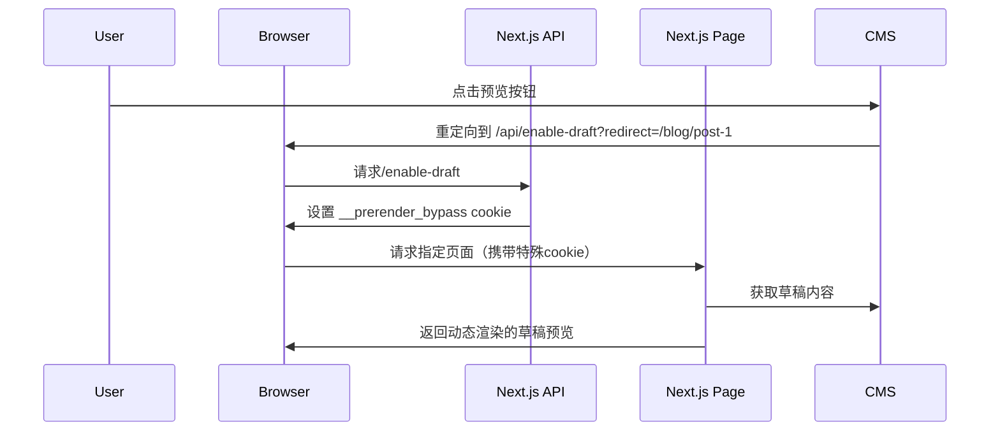

+ Next.js 的草稿模式（Draft Mode）是一个强大的功能，专为**内容预览**场景设计



```js
// draftMode 是一个异步函数
// 从 `next/headers`中导入 `draftMode`，调用 `enable()` 方法
import { draftMode } from "next/headers";

export async function GET(request) {
  const draft = await draftMode();
  draft.enable();
  return new Response("Draft mode is enabled");
}

```

+ 请求接口后，会响应一个 Set-Cookie，名为 `__prerender_bypass=xxx`

# CSP（Content Security Policy）内容安全策略

