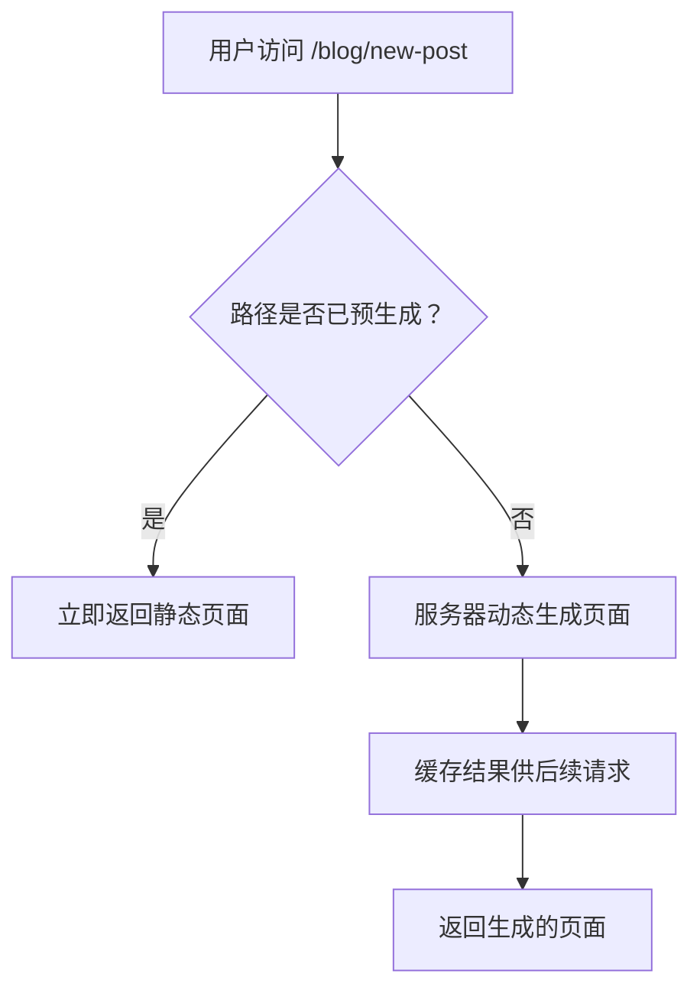
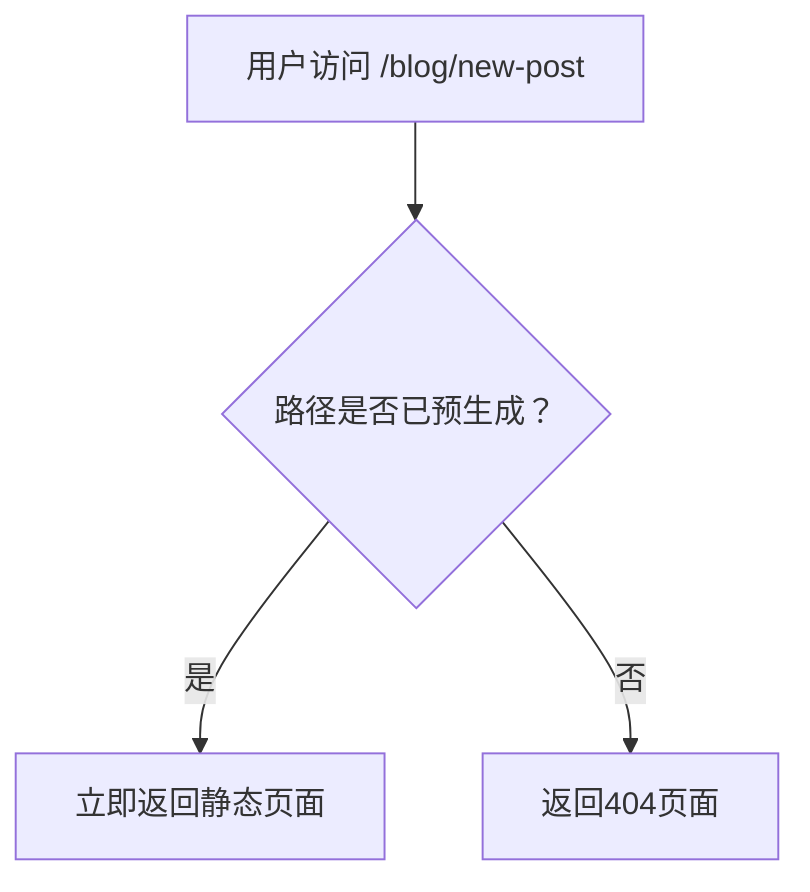

+ 操作系的 **环境变量** 可以理解成 系统定义的全局变量

```shell
// 查看所有环境变量
printenv

// 查看特定的环境变量
pritenv PATH
// 或
echo $PATH
```

```shell
// 1. 定义临时 环境变量 （重启实效）
export YAYUCUSTOM=yayu

// 2. 打印
echo $YAYUCUSTOM
```

```js
// 利用环境变量执行代码

"scripts": {
    "dev": "export NODE_ENV=development && node index.js",
    "prod": "export NODE_ENV=production && node index.js"
}

// 获取 环境变量，
console.log(process.env.NODE_ENV)
```

+ 以 `/etc`开头的目录是系统级别的环境变量定义，其他则是用户级别的环境变量定义
+ 使用 `bash` 建议修改 `~/.bash_profile`，使用 `zsh` 建议修改 `~/.zshrc`。


```bash
// 1. 修改文件
vim ~/.bash_profile
// 2. 添加内容
export YAYU_CUSOTM=yayu
// 3. 使用 wq 命令退出保存后执行使其生效
source  ~/.bash_profile
// 4. 查看生效
echo $YAYU_CUSOTM
```

## process.env

node 提供了 process.env 在 node 中获取环境变量的方法。

## NextJS

Next.js 支持从 `.env.local`中加载环境变量到 `process.env`。

```js
// 可以通过 $ 获取其他环境变量

TWITTER_USER=nextjs
TWITTER_URL=https://twitter.com/$TWITTER_USER
```

### 浏览器中获取环境变量

+ Next.js 可以在构建的时候，将值内联到客户端的 js bundle 中,替换掉所有硬编码使用 `process.env.[variable]`的地方.（就是直接把使用到环境变量的地方，直接替换成真实的值）

需要在变量前添加 `NEXT_PUBLIC_`前缀，这样子客户端也能够访问到

如果没有 `NEXT_PUBLIC_`前缀，正常点击的时候获取的值会是 `undefined` ，添加 `NEXT_PUBLIC_`前缀后即可获取到正确的值。本质上：（构建的时候，将所有 `NEXT_PUBLIC_`前缀的值做了替换）

```js
NEXT_PUBLIC_ANALYTICS_ID=abcdefghijk
```

+ 对于动态查找环境变量，一般不会替换，所以不能生效

### 默认环境变量

通常一个 `.env.local`文件就够用了，但有的时候，你也许会希望在 `development`（`next dev`）或 `production`（`next start`）环境中添加一些默认值。

Next.js 支持在 `.env`（所有环境）、`.env.development`（开发环境）、`.env.production`（生产环境）中设置默认的值。

`.env.local`会覆盖这些默认值。

 `.env*.local`应该添加到 `.gitignore`，一般用来存放机密文件

如果环境变量 NODE\_ENV 未设置，当执行 `next dev`的时候，Next.js 会自动给 `NODE_DEV`赋值 `development`，其他命令则会赋值 `production`。也就是说，当执行 `next dev`或者其他命令的时候，获取`process.env.NODE_ENV`是有值的，这是 Next.js 自动赋值的，为了帮助开发者区分开发环境。

建立一个 `.env.test`文件用于测试环境，但是跟开发环境、生产环境不同的是，测试环境不会加载 `.env.local`中的值，这是为了让每个人都产生相同的测试结果。这些默认值会在 `NODE_DEV`设置成 `test`的时候用到。

### 环境变量加载顺序

环境变量的查找也是有顺序的，一旦找到，就会终止查找，不会再往下查找，这个顺序是：

1.  `process.env`
2.  `.env.$(NODE_ENV).local`
3.  `.env.local` (当 `NODE_ENV` 是 `test` 的时候不会查找)
4.  `.env.$(NODE_ENV)`
5.  `.env`

### 绝对地址导入和模块路径别名

```json
// tsconfig.json or jsconfig.json
{
  "compilerOptions": {
    "baseUrl": ".",
    "paths": {
      "@/components/*": ["components/*"]
    }
  }
}
```

`paths` 中的地址是相对于 `baseUrl` 的

## 路由段配置（Route Segment Config）

+ 路由段配置选项可以配置页面、布局、路由处理程序的行为。
+ 路由段配置（Route Segment Config）指的就是在路由文件，在路由文件上，导出指定的变量，为该路由做一些配置
+ 

```js
// layout.js | page.js | route.js
export const dynamic = 'auto'
export const dynamicParams = true
export const revalidate = false
export const fetchCache = 'auto'
export const runtime = 'nodejs'
export const preferredRegion = 'auto'
export const maxDuration = 5
 
export default function MyComponent() {}
```


| **变量名**                                                   | **类型**                                                     | **默认值**   |
| ------------------------------------------------------------ | ------------------------------------------------------------ | ------------ |
| [dynamic](https://nextjs.org/docs/app/api-reference/file-conventions/route-segment-config#dynamic) | `'auto' \| 'force-dynamic' \| 'error' \| 'force-static'`     | `'auto'`     |
| [dynamicParams](https://nextjs.org/docs/app/api-reference/file-conventions/route-segment-config#dynamicparams) | `boolean`                                                    | `true`       |
| [revalidate](https://nextjs.org/docs/app/api-reference/file-conventions/route-segment-config#revalidate) | `false \| 'force-cache' \| 0 \| number`                      | `false`      |
| [fetchCache](https://nextjs.org/docs/app/api-reference/file-conventions/route-segment-config#fetchcache) | `'auto' \| 'default-cache' \| 'only-cache' \| 'force-cache' \| 'force-no-store' \| 'default-no-store' \| 'only-no-store'` | `'auto'`     |
| [runtime](https://nextjs.org/docs/app/api-reference/file-conventions/route-segment-config#runtime) | `'nodejs' \| 'edge'`                                         | `'nodejs'`   |
| [preferredRegion](https://nextjs.org/docs/app/api-reference/file-conventions/route-segment-config#preferredregion) | `'auto' \| 'global' \| 'home' \| string \| string[]`         | `'auto'`     |
| [maxDuration](https://nextjs.org/docs/app/api-reference/file-conventions/route-segment-config#maxduration) | `number`                                                     | 部署平台设置 |

### 1. dynamic

+ **静态渲染（Static Rendering）**，指的是路由在构建时渲染，或者在重新验证后后台渲染，其结果会被缓存并可以推送到 CDN。适用于未针对用户个性化且数据已知的情况，比如静态博客文章、产品介绍页面等。
+ **动态渲染（Dynamic Rendering）**，指的是路由在请求时渲染，适用于针对用户个性化或依赖请求中的信息（如 cookie、URL 参数）的情况。

+ 因为渲染模式和数据缓存是相互独立的，所以在动态渲染下，数据请求也分为缓存和不缓存（[uncached data request](https://nextjs.org/docs/app/building-your-application/data-fetching/fetching-caching-and-revalidating#opting-out-of-data-caching)）的。默认是缓存，这样做的好处在于，即便选择了动态渲染，也不用担心渲染时获取所有数据对性能造成影响。

+ `dynamic` 影响的不仅是渲染模式，也会影响数据缓存的方式。

+ **动态函数（Dynamic Functions）**，指的是获取只能在请求时才能得到的信息（如 cookie、请求头、URL 参数）的函数，在 Next.js 中，对应的就是 `cookies()`、`headers()`、`useSearchParams()`、`searchParams()` 这些函数。如果使用了这些函数的任意一个，都会导致路由进行动态渲染。
+ 配置：
  + `'auto'`（默认）：自动判断
  + `'force-dynamic'`，强制动态渲染和退出所有 fetch 请求缓存，相当于：
    *   Page Router 下使用了 `getServerSideProps()`
    *   将布局或页面中每个 `fetch()` 请求都设置为 `{ cache: 'no-store', next: { revalidate: 0 } }`
    *   设置了路由段配置 `export const fetchCache = 'force-no-store'`
  + `'error'`强制静态渲染并缓存数据，如果有组件使用了动态函数或不缓存数据请求（[uncached data request](https://nextjs.org/docs/app/building-your-application/data-fetching/fetching-caching-and-revalidating#opting-out-of-data-caching)），就会导致错误，相当于：
    *   Page Router 下使用了`getStaticProps()`
    *   将布局或页面中每个 `fetch()` 请求都设置为 `{ cache: 'force-cache' }`
    *   设置了路由段配置 `fetchCache = 'only-cache', dynamicParams = false`
    *   设置`dynamic = 'error'` 会更改 `dynamicParams` 的默认值 `true` 为 `false`
  + `'force-static'` 强制静态渲染并缓存数据，强制 `cookies()`、`headers()`、`useSearchParams()` 返回空值。
+ 作用的文件

```js
// layout.js | page.js | route.js
export const dynamic = 'auto'
// 'auto' | 'force-dynamic' | 'error' | 'force-static'
```

### 2. dynamicParams

+ `dynamicParams` 是一个重要的路由配置选项，它控制**如何处理在生成静态参数时未包含的动态路由**

|       设置        |   访问预生成路径   | 访问未预生成路径 |      使用场景      |
| :---------------: | :----------------: | :--------------: | :----------------: |
| **`true`** (默认) | ✅ 立即响应静态页面 |  ✅ 按需生成页面  | 内容经常变更的站点 |
|    **`false`**    | ✅ 立即响应静态页面 | ❌ 返回 404 错误  | 完全静态不变的站点 |

+ #### `dynamicParams = true` (默认行为)



实际效果：

- 预生成路径：即时加载（毫秒级响应）
- 新路径：首次访问延迟生成，后续请求缓存加速

- **优势**：自动扩展新内容，无需重新部署

2. #### `dynamicParams = false` (严格模式)



- 实际效果：
  - 预生成路径：即时加载
  - 新路径：硬性 404 错误
- **使用场景**：完全静态站点，不允许新增路径
- 开发中如何设置：比如blog，预设生成前100个，超出的，动态生成。在商城一般会生成所有产品目录，如果出现不存在的，直接返回404

+ 作用文件：

```js
// layout.jsx | page.jsx
export const dynamicParams = true // true | false,
```

### 3. revalidate

设置布局或者页面的默认验证时间。此设置不会覆盖单个 `fetch` 请求设置的 `revalidate` 的值。注意 `revalidate` 选项只能用于 Nodejs Runtime（传统服务环境），不能用于 Edge Runtime（边缘服务环境）。

+ `false`（默认），语义上相当于 `revalidate: Infinity`，资源无限期缓存。
+ `0`，页面或布局总是动态渲染，即使没有使用动态函数或者不缓存数据请求（[uncached data request](https://nextjs.org/docs/app/building-your-application/data-fetching/fetching-caching-and-revalidating#opting-out-of-data-caching)）。
+ `number` ：设置布局或页面的默认重新验证频率，以秒为单位。
+ 一个路由可能有多个布局和一个页面，此时会选择最低的 `revalidate` 值作为路由的重新验证频率。这是为了确保子路由的重新验证时间频率和父布局保持一致

```js
// layout.jsx | page.jsx | route.js
```

### 4. fetchCache

 Next.js，默认情况下，Next.js 会缓存在动态函数使用之前的 `fetch` 请求，不会缓存任何动态函数之后的`fetch` 请求。而 `fetchCache` 允许你覆盖布局或者页面中所有的 `fetch`请求的默认 `cache`选项。

+ 配置 fetchCache 会覆盖当前页面的所有fetch 的 cache 的选项

```js
fetch(`https://...`, { cache: 'force-cache' | 'no-store' })

// `force-cache`是默认值，表示优先从缓存中查找匹配请求，当没有匹配项或者匹配项过时时，才从服务器上获取资源并更新缓存。

// `no-store`表示每次请求都从服务器上获取资源，不从缓存中查，也不更新缓存。
```

+ `'auto'`（默认）：动态函数之前按照开发者设置的 `cache` 选项进行缓存，动态函数之后不缓存请求
+ `'default-cache'`：开发者可以自由设置 `cache` 选项，但如果开发者未设置 `cache` 选项，默认设置为 `force-cache`，这意味着即使是在动态函数之后的请求，也会被视为静态
+ `'only-cache'`：如果开发者未设置 `cache` 选项，默认设置为 `force-cache`，如果有请求设置成 `cache: 'no-store'`，则会导致报错
+ `'force-cache'`：将所有请求的 `cache` 选项设置为 `force-cache` 。
+ `'default-no-store'`：开发者可以自由设置 `cache` 选项，但如果开发者未设置 `cache` 选项，默认设置为 `no-store`，这意味着即使是在动态函数之前的请求，也会被视为动态。
+ `'only-no-store'`：如果开发者未设置 `cache` 选项，默认设置为 `no-store`，如果有请求设置成 `cache: 'force-cache'`，则会导致报错
+ `'force-no-store'`：将所有请求的 `cache` 选项设置为 `no-store` 。

一个路由可能有多个布局和一个页面，此时选项应该相互兼容：

*   如何 `'only-cache'` 和 `'force-cache'` 同时提供，`'force-cache'` 获胜。如果 `'only-no-store'` 和 `'force-no-store'`同时提供，`'force-no-store'`获胜。带 `force` 的选项会更改整个路由的行为，并会阻止 `'only-*'` 引发的错误。
*   `'only-*'` 和 `force-*'`选项的作用就是确保整个路由要么是完全静态要么是完全动态，这意味着：
    *   在单个路由中不允许同时使用 `'only-cache'`和 `'only-no-store'`
    *   在单个路由中不允许同时使用 `'force-cache'`和 `'force-no-store'`
*   如果子级提供了 `'auto'`或  `'*-cache'`，父级无法使用 `'default-no-store'`，因为这会导致请求有不同的行为。

Next.js 建议共享的父布局使用 `'auto'`，在子级中自定义不同的选项。

```js
// layout.jsx | page.jsx | route.js
```

### 5. runtime

设置运行时环境

```js
// layout.jsx | page.jsx | route.js
```

*   `nodejs`（默认）
*   `edge`

### 6. preferredRegion

在 [Vercel Serverless Functions](https://vercel.com/docs/functions/serverless-functions) 中使用，搭配 `export const runtime = 'edge'; `，用于设置 [Edge Functions](https://vercel.com/docs/functions/configuring-functions/region) 执行的区域，默认情况下，Edge Functions 在最接近传入请求的区域中执行，但如果你的函数比较依赖数据源，你会更希望它靠近数据源所在的位置以实现快速响应，那就可以设置 preferredRegion 指定一系列首选区域

指定区域的时候，传入的是区域 ID，区域列表参考 [Vercel 的 Region List 文档](https://vercel.com/docs/edge-network/regions)，其中 iad1 表示美国东部区域，参考位置美国华盛顿地区，sfo1 表示美国西部，参考位置美国旧金山。

```javascript
// layout.jsx | page.jsx | route.js
export const preferredRegion = 'auto'
// 'auto' | 'global' | 'home' | ['iad1', 'sfo1']
```

### 7. maxDuration

略

### 8 generateStaticParams

略

## 问题：

Nodejs Runtime 和 Edge Runtime 是什么