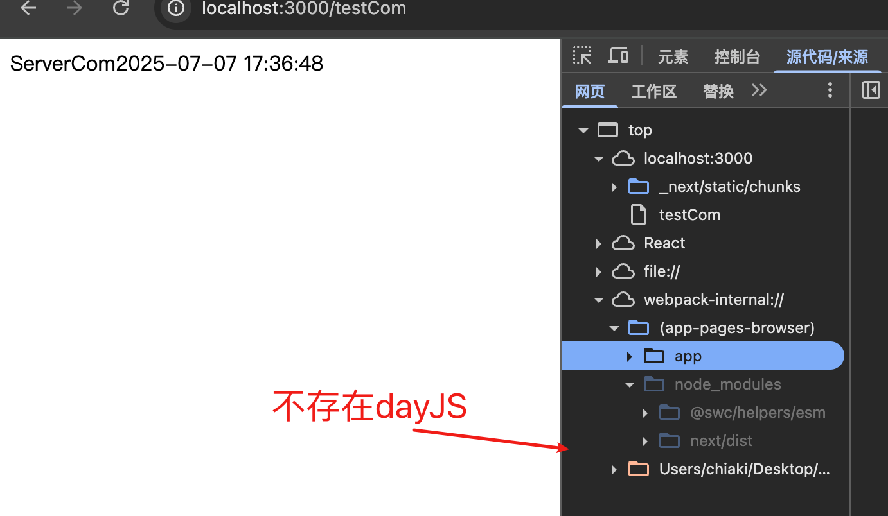
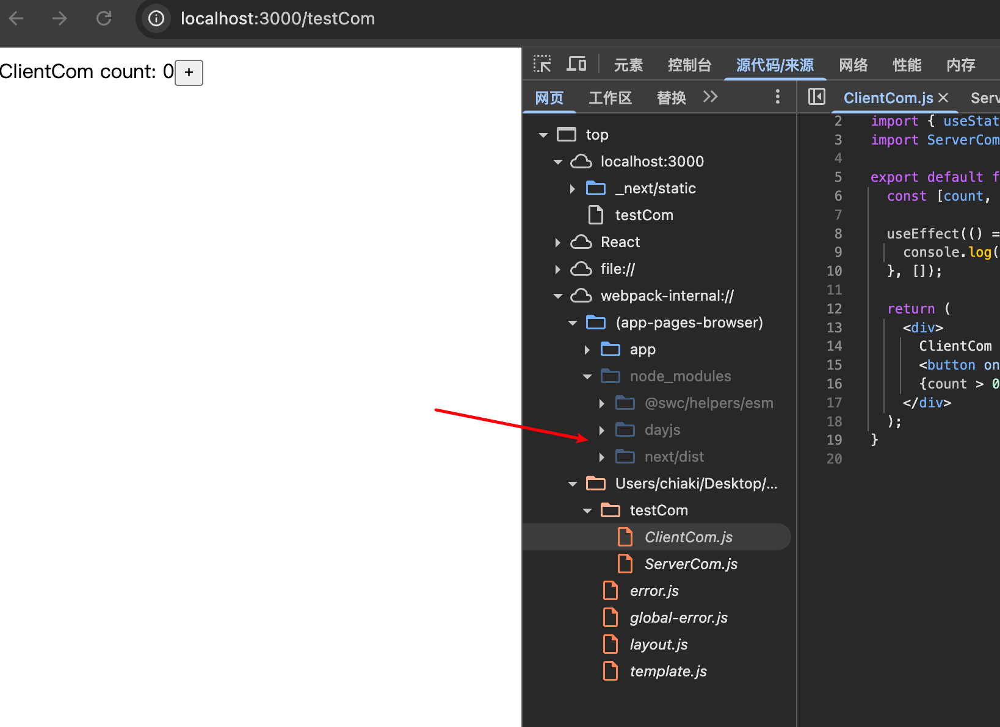

# 笔记

## 1. 服务端组件可以导入客户端组件，但客户端组件不能导入服务端组件

+ 这句话可以理解是对的，也不对
+ 因为客户端组件导入其他的组件，都会变成客户端组件
+ 举个例子：

```js
// ClientCom.js
"use client";
import { useState, useEffect } from "react";
import ServerCom from "./ServerCom";

export default function ClientCom() {
  const [count, setCount] = useState(0);

  useEffect(() => {
    console.log("ClientCom");
  }, []);

  return (
    <div>
      ClientCom count: {count}
      <button onClick={() => setCount(count + 1)}>+</button>
      {count > 0 && <ServerCom />}
    </div>
  );
}

```

```js
// ServerCom.js
import dayjs from "dayjs";

export default function ServerCom() {
  return (
    <div>
      ServerCom
      {dayjs().format("YYYY-MM-DD HH:mm:ss")}
    </div>
  );
}

```

```js
// page.js
import ClientCom from "./ClientCom";
import ServerCom from "./ServerCom";

export default function TestCom() {
  return <ServerCom />;
  // return <ClientCom />;
}
```

+ 当我直接服务端组件导入服务端组件的时候，不存在dayJS，因为渲染在服务器执行，dayjs不参与生产bundle



```js
// page.js
import ClientCom from "./ClientCom";
import ServerCom from "./ServerCom";

export default function TestCom() {
  // return <ServerCom />;
  return <ClientCom />;
}
```

+ 即使ServerCom是服务端组件，因为父组件是客户端的原因，渲染方式变成了客户端组件，所以dayjs参与打包



+ 所以如果客户端导入服务端组件，就会造成服务端组件失去服务端渲染特性

## 2. 客户端组件中导入的子组件默认会自动成为客户端组件

+ 第一：理论上，客户端组件是不鼓励导入服务端组件的
+ 但是如果客户端组件导入服务端组件，会导致服务端组件失去服务端特性，客户端导入组件，会被转为客户端渲染方式

+ ### 🌐 混合渲染策略

| **场景**                   | **是否允许** | **解决方案**                |
| :------------------------- | :----------- | :-------------------------- |
| 服务端组件导入客户端组件   | ✅ 允许      | 直接作为 JSX 标签使用       |
| 客户端组件导入服务端组件   | ❌ 禁止      | 通过 props.children 传递    |
| 服务端组件使用客户端钩子   | ❌ 禁止      | 将逻辑移至客户端组件        |
| 服务端组件传递数据给客户端 | ✅ 允许      | 通过 props 传递可序列化数据 |

## 3. 客户端组件如何使用服务端组件

- 客户端组件中，并不难直接导入服务端组件使用

- 可以通过在使用客户端组件的上一层，将服务端组件作为客户端组件的 children 使用。

- 当然也可以直接使用，服务端组件转成客户端组件

## 4. 为什么服务端组件传递给客户端组件的数据必须序列化

- 根本原因：服务端与客户端的环境隔离（运行环境不同）

  - 服务端组件：在 Node.js 环境中执行
  - 客户端组件：在浏览器环境中执行
  - 两者之间没有共享内存空间

- 其他原因：

  - 一致性要求：确保服务端生成的 HTML 与客户端水合结果一致
  - 安全隔离：防止服务端敏感数据/方法泄露到客户端
  - 性能优化：JSON 序列化是高效的数据传输方式

+ ### 不可序列化数据的典型问题

| **数据类型**     | **问题**                     | **示例**                        |
| :--------------- | :--------------------------- | :------------------------------ |
| **函数**         | 无法被 JSON.stringify() 转换 | `() => console.log('test')`     |
| **类实例**       | 丢失原型链和方法             | `new Date()`, `new Map()`       |
| **循环引用对象** | JSON.stringify() 会抛出错误  | `let a={}; a.self=a`            |
| **Symbol**       | 序列化后变为 `{}`            | `Symbol('id')`                  |
| **自定义类**     | 反序列化后变成普通对象       | `class User { getName(){...} }` |
| **React 组件**   | 无法通过网络传输             | `<MyComponent />`               |

## 5. Suspense 使用

+ 当你请求一个带有Suspense的组件页面，可以观察到一开始显示时间为毫秒级别，首页完成了显示，但是内容不全
+ 查看请求头，发现其 `Transfer-Encoding` 标头的值为 `chunked`，表示数据将以一系列分块的形式进行发送。HTML 首先收到骨架图的 HTML 进行渲染，再收到渲染完成的笔记列表 HTML 进行渲染
+ 随后查看网络时间，变成了秒级，而且加载的HTML，也发生了变化
+ Suspense 的效果就是允许你推迟渲染某些内容，直到满足某些条件（例如数据加载完毕）

## 6. RSC Payload

+ 当你点击页面的时候，请求RSC，可以看到标签显示的是`?rsc=xxxx`其实就暗示了它跟 RSC 相关,返回的是一种React自定义的特殊格式
+ SC Payload 包含信息：

  1.  服务端组件的渲染结果
  2.  客户端组件的占位位置和引用文件
  3.  从服务端组件传给客户端组件的数据
+ **使用这种格式的优势在于它针对流做了优化，数据是分行的，它们可以以流的形式逐行从服务端发送给客户端，客户端可以逐行解析 RSC Payload，渐进式渲染页面。**
+ SSR 和 RSC 的最大区别，其实现的关键就在于服务端组件没有被渲染成 HTML，而是一种特殊的格式（RSC Payload）
  +  SSR 和 RSC 是互补关系，是可以一起使用的，Next.js 中两者就是一起使用的。
  + RSC 的代码不会发送到客户端，但传统 SSR 所有组件的代码都会被发送到客户端
  + RSC 可以在组件树中任意位置获取后端，传统 SSR 只能在顶层（getServerSideProps）访问后端
  + 服务器组件可以重新获取，而不会丢失其树内的客户端状态

## 7. 什么是路由缓存

+ 路由缓存的工作原理

1. 触发时机：
   - 构建时（`next build`）自动缓存静态路由。
   - 运行时访问新路由时，首次生成后缓存。
2. **存储内容**：
   缓存的不是原始数据，而是​**​渲染完成的 React 组件树​**​（静态 HTML 片段）。
3. **缓存范围**：
   每个路由段独立缓存（如 `/dashboard` 和 `/dashboard/settings` 分开缓存）。
4. **有效时长**：
   默认持久化（直到手动失效或重新构建），但可通过配置调整。

+ 大概就是构建路由和访问路由的时候，会做缓存，混存的是一个渲染完成的React组件树

## 8. 路由缓存的持续时间

路由缓存存放在浏览器的临时缓存中，有两个因素决定了路由缓存的持续时间：

*   Session，缓存在导航时持续存在，当页面刷新的时候会被清除
*   自动失效期：单个路由段会在特定时长后自动失效
    * **如果路由是静态渲染，持续 5 分钟**
    * **如果路由是动态渲染，持续 30s**
    * 自定义配置：通过 `next.config.js` 调整

## 9. 如何让路由缓存刷新/失效

1. **时间驱动重新验证（Revalidation**

```js
// 每 60 秒自动失效并重新生成缓存
export const revalidate = 60; 
```

2. **revalidatePath**

```js
import { revalidatePath } from 'next/cache';
revalidatePath('路由');
```

3. **revalidateTag**

```js
// Step 1: 在数据请求时添加标签
fetch('https://...', { next: { tags: ['posts'] } });

// Step 2: 需要失效时
import { revalidateTag } from 'next/cache';
revalidateTag('posts'); // 清除所有关联该标签的路由缓存
```

4. 使用动态函数强制动态渲染

```js
cookies.set、cookies.delete
```

5. 调用 `router.refresh` 会使路由缓存失效并发起一个重新获取当前路由的请求

6. **数据缓存退出方式 - cache: no-store**

```js
fetch(`https://...`, { cache: 'no-store' })
```

7. **数据缓存退出方式 - 路由段配置 force-dynamic**

```js
export const dynamic = 'force-dynamic'
// 等价于
export const revalidate = 0
```

## 10. revalidatePath

| 代码                            | 含义                                                    |
| :------------------------------ | :------------------------------------------------------ |
| `revalidatePath('/')`           | 刷新首页 (`page.js`)，**不刷新布局**                    |
| `revalidatePath('/', 'page')`   | 同上 (默认模式)                                         |
| `revalidatePath('/', 'layout')` | **强制刷新根布局+所有子页面**，适用于全局数据变更的场景 |

+ 参数一：目标路径
+ 参数二：刷新范围
  + `'layout'`: （**布局级刷新**）
  + `'page'`：仅当前页面 (默认)

## 11. Middleware

+ 在 Next.js 中，**一个项目只能有一个顶层的 `middleware.js`/`middleware.ts` 文件**（位于项目根目录或 `src` 根目录）。这是 Next.js 中间件的设计约束
  + 所以所有中间件处理逻辑都只能在 middleware.js 中处理。

+ 配置

  ```js
  // 使用 matcher 控制执行范围
  // 通过配置指定中间件只在特定路径触发，减少不必要执行
  export const config = {
    matcher: [
      '/dashboard/:path*', // 仅保护 dashboard 路由
      '/user/:path*',      // 仅保护 user 路由
      '/',                 // 仅处理根路径
    ],
  };
  ```

+ **接受参数`request: NextRequest`**

这是唯一的参数，包含以下核心属性和方法：

| 属性/方法         | 类型             | 说明                          |
| :---------------- | :--------------- | :---------------------------- |
| `request.nextUrl` | `URL` 对象       | 扩展的 URL 对象，提供额外方法 |
| `request.cookies` | `RequestCookies` | 操作请求的 cookies            |
| `request.headers` | `Headers`        | 访问请求头                    |
| `request.geo`     | `Object`         | 客户端地理位置信息            |
| `request.ip`      | `string`         | 客户端 IP 地址                |
| `request.method`  | `string`         | HTTP 方法 (GET/POST 等)       |
| `request.body`    | `ReadableStream` | 请求体数据流                  |

+ **`request.nextUrl` (最重要)**
  + **`url.pathname`**: 当前路径 (`/dashboard/user`)
  + **`url.searchParams`**: URL 查询参数对象
  + **`url.href`**: 完整 URL
  + **`url.origin`**: 协议+域名 (`https://example.com`)
  + **`url.locale`**: 当前语言环境 (自动检测)
  + **修改方法**:
    - `url.pathname = '/new-path'` (重写路径)
    - `url.searchParams.set('key', 'value')` (修改查询参数)

# 问题

- redis 使用
- ioredis 使用
- useTransition


