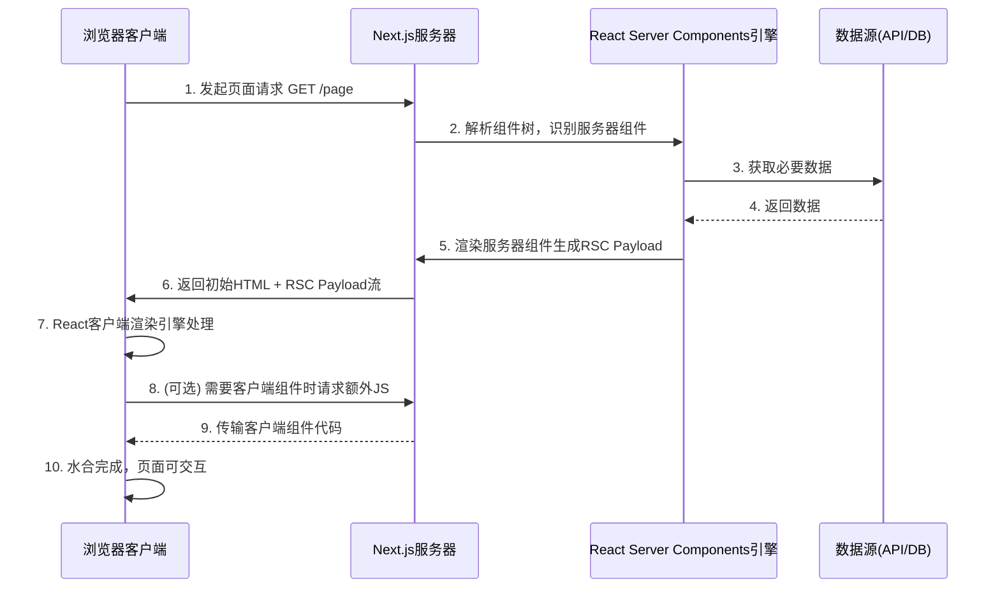

# React Server Components (RSC) 渲染流程详解

您对RSC流程的理解基本正确，但可以更精确一些。让我们深入探讨React Server Components的完整渲染流程，特别是Next.js中的具体实现方式：

## 🔄 完整的RSC渲染流程（基于Next.js App Router）



### 详细步骤解释：

### 1. 浏览器发起请求 (Client → Server)

用户访问页面URL，浏览器向Next.js服务器发送HTTP请求

### 2. 服务器解析组件树 (Server → RSC)

Next.js服务器解析`app`目录结构，确定该路由所需渲染的组件：

```js
// app/page.js
export default function Home() {
  return (
    <Layout>
      <MainContent />
      <Sidebar />
    </Layout>
  )
}
```

### 3. 数据获取 (RSC → DataSources)

服务器组件直接访问数据源（无需客户端发送请求）：

```js
// app/MainContent.server.js
export default async function MainContent() {
  const posts = await fetch('https://api.example.com/posts'); 
  // 直接在服务器上执行，对客户端不可见
  return <PostList posts={posts} />;
}
```

### 4. 数据返回 (DataSources → RSC)

数据源返回数据给RSC引擎

### 5. 生成RSC Payload (RSC → Server)

React服务器组件引擎生成**特殊格式的二进制流**(RSC Payload)，包含：

- 渲染后的UI结构描述
- 客户端组件占位符引用
- 序列化的props数据
- 水合指令

### 6. 流式响应返回 (Server → Client)

服务器返回**分块传输**(chunked encoding)的响应：

```http
HTTP/1.1 200 OK
Content-Type: text/x-component
Transfer-Encoding: chunked

1: ["$","html",{},...
2: ["$","body",{},...
3: ["$","div",{className:...
...
7: ["$","$L1",null,{...}]  # 客户端组件占位符
```

同时包含：

- **初始HTML骨架**（极简结构）
- **RSC Payload流**（包含实际内容）
- **客户端运行时**（React核心库）

### 7. 客户端处理RSC Payload (Client)

React客户端引擎接收流并逐步处理：

+ 得到的是一个二进制数据然后转React Element对象，然后通过挂载函数挂载。

```js
// 浏览器中React的处理流程
function processRSCStream(stream) {
  const reader = stream.getReader();
  
  const process = async () => {
    while (true) {
      const { done, value } = await reader.read();
      if (done) break;
      
      // 将二进制块转换为React元素
      const elements = decodeRSCChunk(value);
      
      // 渐进式更新DOM
      ReactDOM.updateRoot(rootNode, elements);
    }
  };
  
  process();
}
```

### 8. 客户端组件请求 (可选) (Client → Server)

当遇到客户端组件时：

```js
// app/Sidebar.client.js
'use client';
import { useState } from 'react';

export default function Sidebar() {
  const [open, setOpen] = useState(false);
  return (
    <aside>
      <button onClick={() => setOpen(!open)}>Toggle</button>
      {open && <Menu />}
    </aside>
  )
}
```

浏览器按需请求该组件的JS代码（如果尚未缓存）

### 9. 传输客户端代码 (Server → Client)

服务器发送客户端组件所需的JavaScript包

### 10. 水合完成 (Client)

客户端组件接收后：

- 附加事件处理器
- 初始化状态
- 完成交互准备

## 📊 RSC Payload 结构详解

RSC Payload不是标准的JSON，而是React专用的高效二进制格式：

### 示例payload结构

```json
1:J["$","html",null,{"children":[
  2:J["$","body",null,{"children":[
    3:J["$","div",null,{"className":"container","children":[
      4:["$","main",null,{...}], 
      5:["$","$L1",null,{"__id":"./Sidebar.client.js"}] // 客户端组件占位符
    ]}]
  ]}]
]}
```

### 关键特点

1. **高效序列化**：比JSON更紧凑的二进制格式
2. **引用标记**：`$L1`表示客户端组件插槽
3. **渐进传输**：内容分块发送，优先级更高的内容先发送
4. **无敏感数据**：服务器数据不会暴露在客户端代码中

## 🔍 客户端-服务器组件交互示例

```js
// app/page.js (服务器组件)
import SearchBar from './SearchBar.client'; // 导入客户端组件
import SearchResults from './SearchResults'; // 服务器组件

export default function SearchPage() {
  // 服务器组件不能使用状态
  return (
    <div>
      <SearchBar />
      {/* 结果区域仍由服务器组件控制 */}
      <SearchResults />
    </div>
  );
}

// app/SearchBar.client.js
'use client';
import { useState } from 'react';

export default function SearchBar() {
  const [query, setQuery] = useState('');

  return (
    <input 
      value={query} 
      onChange={(e) => setQuery(e.target.value)}
      placeholder="搜索内容..."
    />
  );
}

// app/SearchResults.js (服务器组件)
export default async function SearchResults({ searchParams }) {
  // 直接从URL参数获取搜索词
  const query = searchParams.q;
  const results = await fetchResults(query);
  
  return (
    <ul>
      {results.map(item => (
        <li key={item.id}>{item.title}</li>
      ))}
    </ul>
  );
}
```

## 🚀 RSC渲染的优势

1. **零捆绑尺寸组件**：

   ```js
   // 引入大型库但不会增加客户端包大小
   import heavyDataProcessor from 'data-heaver'; // 仅服务器端
   ```

2. **自动代码拆分**：

   ```js
   // 无需手动import()，自动按客户端组件拆分
   ```

3. **减少客户端水合成本**：

   + 比起传统的水合，RSC的成本更低

   ```mermaid
   pie
     title 水合成本比较
     “传统SSR”： 80
     “RSC”： 20
   ```

4. **流式渲染体验**：

   ```js
   // 结合Suspense实现内容渐进加载
   export default function Page() {
     return (
       <Suspense fallback={<Spinner />}>
         <SlowComponent />
       </Suspense>
     )
   }
   ```

## ⚠️ 注意事项与限制

1. **组件边界约束**：

   ```js
   // 无效 - 不能在客户端组件中渲染服务器组件
   function ClientComp({ children }) {
     return <div>{children}</div>;
   }
   
   <ClientComp>
     <ServerComp /> // ❌ 不合法
   </ClientComp>
   ```

   在 Next.js 中，您无法在客户端组件(Client Components)内部渲染服务器组件(Server Components)。这不是一个随意的限制，而是 React Server Components (RSC) 架构设计的**核心原则**

   + 翻译上面这句话：不能直接在客户端组件渲染服务端组件，但是服务端组件会作为children传入到客户端，实现间接的渲染。

   ```mermaid
   graph TB
       SP[父级服务器组件] --> CC[客户端组件]
       CC --> SC[服务端组件作为children属性]
       SP --> DS[数据源]
       CC --> CE[客户端环境]
       SC --> SSE[服务器端执行]
   ```

2. **序列化限制**：

   ```js
   // 从服务器组件传递到客户端组件的props
   <ClientComp 
     data={{
       date: new Date(), // ✅ 自动序列化
       fetch: globalThis.fetch // ❌ 函数不能序列化
     }}
   />
   ```

3. **开发环境差异**：

   ```bash
   # 本地开发是模拟的RSC环境
   next dev → 实际生产行为有所不同
   ```

## 🔮 未来发展方向

1. **服务器动作**：

   ```js
   // 直接从客户端调用服务器函数
   function Form() {
     const submit = useServerAction(async (formData) => {
       // 在服务器执行
       await saveToDatabase(formData);
     });
     
     return <form action={submit}>...</form>;
   }
   ```

2. **智能部分渲染**：

   ```js
   // 仅刷新数据变化部分的UI
   mutate('/api/data', { optimisticUpdate: ... });
   ```

3. **编译器优化**：

   ```js
   // React Forget自动添加memo()
   function Comp(props) { ... } // 自动优化
   ```

通过理解RSC的完整渲染流程，您可以更好地利用这种新型架构构建高性能应用。这种模式将React应用转化为真正的混合渲染系统，结合了客户端交互性和服务器驱动的效率优势。

### 性能优化原则

1. **最小化序列化数据**：只传递必要数据
2. **拆分大型组件**：避免发送过大的组件树
3. **使用代码分割**：动态导入重量级组件
4. **启用缓存**：减少重复渲染
