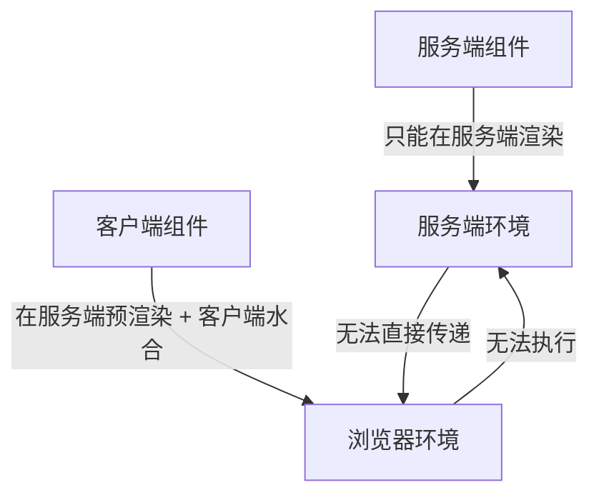
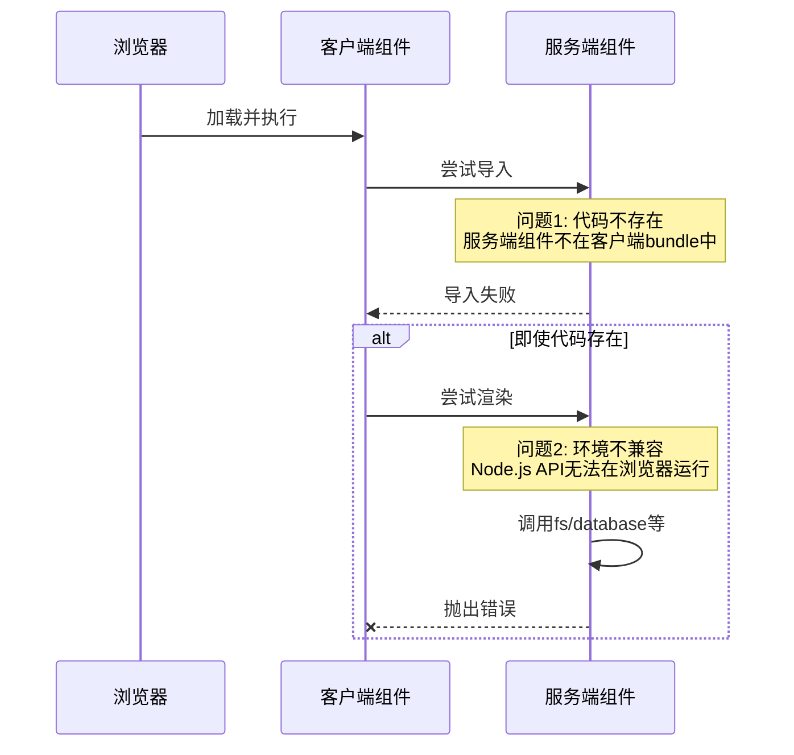
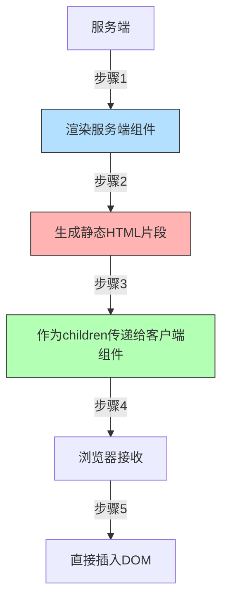
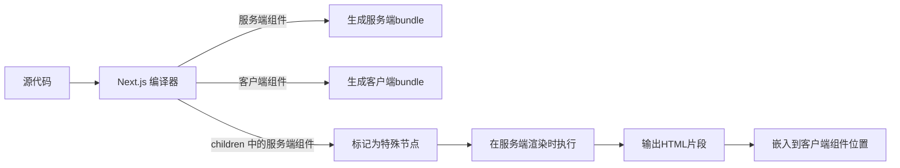

在 Next.js 中，服务端组件只能通过 `children` 的方式传递其他服务端组件，这是框架设计中的一个重要约束。这个限制背后有几个关键的技术原因和设计决策：

### 核心原因：严格的渲染环境隔离

+ 不希望服务端组件代码流入客户端组件中



1. **执行环境不同**：
   - 服务端组件：**只能在 Node.js 环境**执行（包含数据获取、文件系统访问等）
   - 客户端组件：**需要在浏览器环境**执行（包含交互逻辑、DOM 操作等）
   
2. **代码打包隔离**：
   - 服务端组件代码**不会包含在客户端 bundle** 中
   - 客户端组件代码**需要完整打包**到 JS 文件

### 为什么不能直接导入？

如果客户端组件直接导入服务端组件，会导致：



### 为什么 `children` 可以解决？

`children` prop 的工作机制：



1. **渲染时机的关键区别**：

   - 服务端组件在**服务端就已经完成渲染**
   - 传递给客户端组件的只是**渲染结果**（HTML 片段），不是组件本身

2. **数据流方向**：

   ```jsx
   // 正确示例
   export default function ServerParent() {
     return (
       <ClientComponent>
         {/* 服务端组件在服务端渲染 */}
         <ServerChild />
       </ClientComponent>
     );
   }
   ```

   - `ServerChild` 在服务端渲染
   - 渲染结果作为 `children` 传递给 `ClientComponent`
   - 客户端只接收到静态 HTML，不需要执行服务端代码

### 技术实现细节

在 Next.js 编译过程中：



1. **编译阶段处理**：

   ```js
   // 原始代码
   <ClientComponent>
     <ServerChild />
   </ClientComponent>;

   // 编译后（服务端）
   React.createElement(ClientComponent, {
     children: ServerChild.render(), // 服务端执行
   });

   // 编译后（客户端）
   React.createElement("div", {
     dangerouslySetInnerHTML: { __html: "<!-- ServerChild输出 -->" },
   });
   ```

2. **RSC Payload 中的表示**：
   ```json
   {
     "clientComponentId": "client-1",
     "props": {
       "children": {
         "type": "server-component",
         "id": "server-child-1",
         "html": "<div>服务端内容</div>"
       }
     }
   }
   ```

### 设计哲学：关注点分离

| 关注点       | 直接导入                 | children 传递                 |
| ------------ | ------------------------ | ----------------------------- |
| **代码位置** | 客户端尝试加载服务端代码 | 服务端代码保留在服务端        |
| **执行环境** | 浏览器无法执行 Node 代码 | 服务端执行，浏览器只显示      |
| **数据流**   | 双向依赖导致耦合         | 单向数据流（服务端 → 客户端） |
| **安全性**   | 可能暴露服务端实现细节   | 只暴露渲染结果                |
| **性能**     | 增加客户端 bundle 大小   | 零客户端开销                  |

### 实际开发中的模式

1. **布局模式**：

   ```jsx
   // app/layout.js
   export default function RootLayout({ children }) {
     return (
       <html>
         <body>
           <ClientNavBar>
             {/* 服务端内容通过children传递 */}
             {children}
           </ClientNavBar>
         </body>
       </html>
     );
   }
   ```

2. **高阶组件模式**：

   ```jsx
   // app/hoc.js
   "use client";
   export default function AnalyticsWrapper({ children }) {
     useEffect(() => {
       // 客户端分析逻辑
       trackPageView();
     }, []);

     return children; // 渲染服务端内容
   }

   // app/page.js
   import AnalyticsWrapper from './hoc';

   export default function Page() {
     return (
       <AnalyticsWrapper>
         <ServerContent />
       </AnalyticsWrapper>
     )
   }
   ```

3. **插槽模式**：

   ```jsx
   "use client";
   export default function Card({ header, content }) {
     return (
       <div className="card">
         <div className="header">{header}</div>
         <div className="content">{content}</div>
       </div>
     );
   }
   
   // 使用
   <Card
     header={<ServerHeader />} // 服务端组件
     content={<ServerContent />} // 服务端组件
   />;
   ```

### 为什么这个限制很重要？

1. **安全性保障**：
   - 防止服务端代码（数据库访问、密钥处理）意外泄露到客户端
2. **性能优化**：
   - 避免将不必要的服务端逻辑打包到客户端 bundle
3. **架构清晰性**：

   ```mermaid
   graph LR
     A[服务端领域] -->|渲染结果| B[客户端领域]
     B -->|用户交互| C[客户端状态]
     C -->|数据请求| D[API 路由]
     D --> A
   ```

   - 明确划分服务端和客户端责任边界

4. **框架一致性**：
   - 与 React 的复合组件模式保持一致
   - 遵循 React 的数据向下流动原则

### 总结

服务端组件只能通过 `children` 传递的根本原因是**执行环境的严格隔离**：

1. 🛡️ **安全边界** - 防止服务端代码进入客户端环境
2. ⚙️ **环境兼容** - 服务端组件依赖 Node.js 特有的 API
3. 📦 **打包优化** - 避免服务端代码污染客户端 bundle
4. 🔁 **数据流控制** - 强制单向数据流（服务端 → 客户端）
5. 🧩 **架构清晰** - 明确区分静态渲染和交互逻辑

这种设计虽然增加了初始理解的复杂度，但它带来了：

- 更好的安全性
- 更小的客户端 bundle
- 更清晰的架构分层
- 更高效的渲染流水线

理解这个限制有助于开发者更好地利用 Next.js 的混合渲染能力，构建出既快速又安全的现代 Web 应用。
