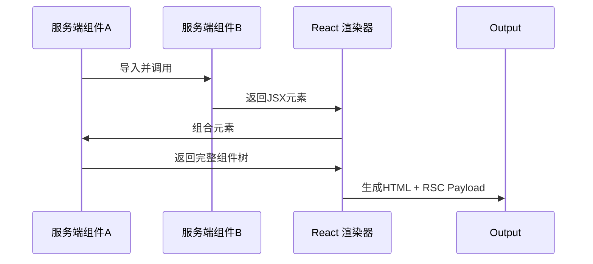
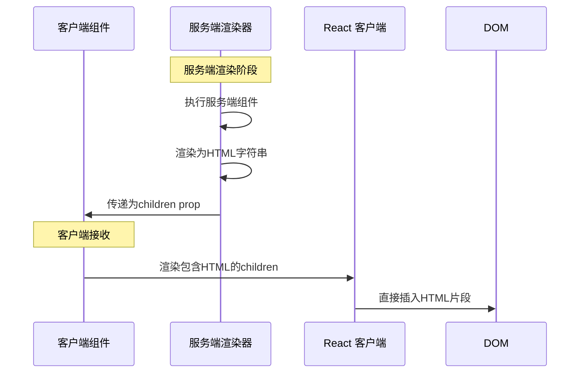
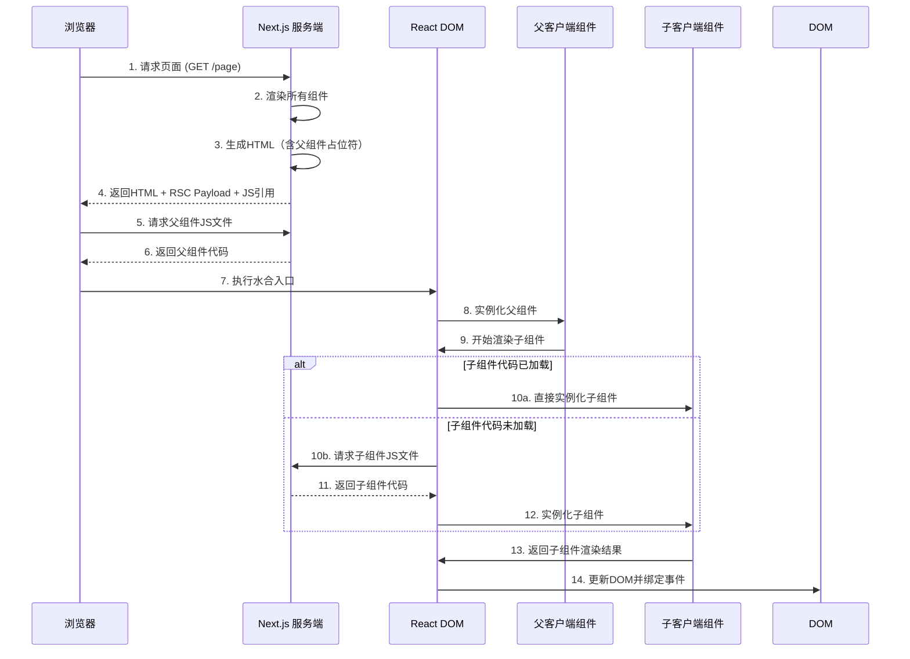

**服务端组件互相导入时**

- 不需要独立的 js 文件

```mermaid
sequenceDiagram
    participant S1 as 服务端组件A
    participant S2 as 服务端组件B
    participant React as React 渲染器

    S1->>S2: 导入并调用
    S2->>React: 返回JSX元素
    React->>S1: 组合元素
    S1->>React: 返回完整组件树
    React->>Output: 生成HTML + RSC Payload
```

**客户端组件使用服务端组件时**

- 需要独立的 js 文件

```mermaid
sequenceDiagram
    participant ClientComp as 客户端组件
    participant Server as 服务端渲染器
    participant React as React 客户端

    Note over Server: 服务端渲染阶段
    Server->>Server: 执行服务端组件
    Server->>Server: 渲染为HTML字符串
    Server->>ClientComp: 传递为children prop

    Note over ClientComp: 客户端接收
    ClientComp->>React: 渲染包含HTML的children
    React->>DOM: 直接插入HTML片段
```

**客户端组件使用客户端组件时**

- 流程类似 SPA

```mermaid
sequenceDiagram
    participant Browser as 浏览器
    participant Server as Next.js 服务端
    participant ReactDOM as React DOM
    participant Parent as 父客户端组件
    participant Child as 子客户端组件

    Browser->>Server: 1. 请求页面 (GET /page)
    Server->>Server: 2. 渲染所有组件
    Server->>Server: 3. 生成HTML（含父组件占位符）
    Server-->>Browser: 4. 返回HTML + RSC Payload + JS引用

    Browser->>Server: 5. 请求父组件JS文件
    Server-->>Browser: 6. 返回父组件代码

    Browser->>ReactDOM: 7. 执行水合入口
    ReactDOM->>Parent: 8. 实例化父组件
    Parent->>ReactDOM: 9. 开始渲染子组件

    alt 子组件代码已加载
        ReactDOM->>Child: 10a. 直接实例化子组件
    else 子组件代码未加载
        ReactDOM->>Server: 10b. 请求子组件JS文件
        Server-->>ReactDOM: 11. 返回子组件代码
        ReactDOM->>Child: 12. 实例化子组件
    end

    Child->>ReactDOM: 13. 返回子组件渲染结果
    ReactDOM->>DOM: 14. 更新DOM并绑定事件
```

- 如果子组件和父组件的 js 在统一 chunk，可以直接实例化
- 如果不再需要再下载一个 js 文件
