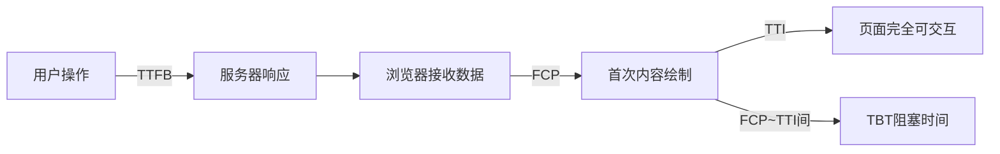
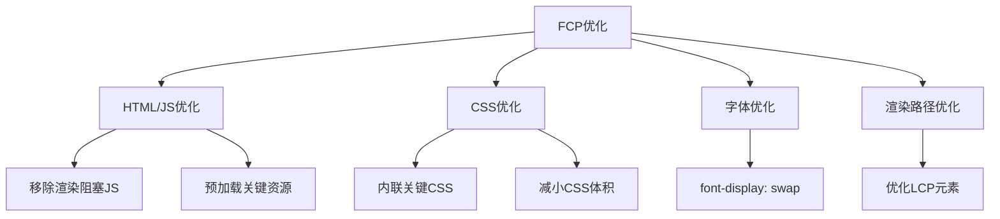
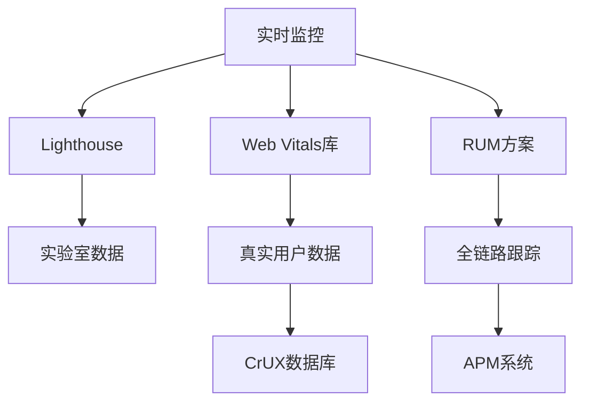
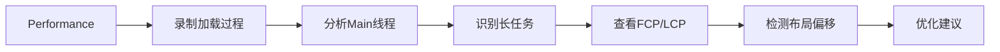

# 前端性能核心指标：TTFB、FCP、TTI、TBT 全面解析

这些指标是现代Web性能监控的基石，共同构成了评估用户体验的关键指标集。让我们深入解析每个指标的技术细节和优化策略。

## 🌐 四大核心性能指标

| 指标     | 全称                   | 定义                           | 重要性         |
| -------- | ---------------------- | ------------------------------ | -------------- |
| **TTFB** | Time To First Byte     | 发起请求到接收第一个字节的时间 | 服务器响应能力 |
| **FCP**  | First Contentful Paint | 首次内容渲染时间               | 用户感知速度   |
| **TTI**  | Time To Interactive    | 页面完全可交互时间             | 用户体验质量   |
| **TBT**  | Total Blocking Time    | 主线程阻塞总时间               | 交互响应能力   |



## 🔍 一、TTFB (Time To First Byte) 首字节时间

### 技术定义

**TTFB = Response Start - Request Start**

- DNS解析时间 + TCP连接时间 + SSL协商时间 + 服务器处理时间

### 优化策略（从低层到高层）

| 层           | 技术                        | 效果提升    |
| ------------ | --------------------------- | ----------- |
| **CDN层**    | Edge Caching                | 减少50%-70% |
| **协议层**   | HTTP/3(QUIC)                | 减少30%-50% |
| **服务器层** | Serverless + Vercel/Netlify | 减少60%-80% |
| **应用层**   | Next.js SSG/ISR             | 提升3-5倍   |

**实测优化示例**：

```js
// Next.js API路由优化
export default function handler(req, res) {
  // 1. 立即设置标头
  res.setHeader('Cache-Control', 's-maxage=10')
  
  // 2. 流式传输响应（增量渲染）
  res.write('{"partial": "data"}')
  
  // 3. 并行处理复杂操作
  const promise = heavyOperation().then(result => {
    res.write(`,"full": ${JSON.stringify(result)}}`)
    res.end()
  });
}
```

## 🎨 二、FCP (First Contentful Paint) 首次内容绘制

### 技术定义

**浏览器首次渲染DOM内容的时间点**，内容元素包括：

- 文本节点`<p><h1>`等
- 图片``
- 非白色Canvas/SVG
- 背景图片（需确保不延迟渲染）

### 性能等级标准

| FCP时间  | 用户体验评级 |
| -------- | ------------ |
| ≤1.0s    | 优秀         |
| 1.0~2.5s | 良好         |
| ≥2.5s    | 较差         |

### 优化策略金字塔



**实际优化案例**：

```js
<!DOCTYPE html>
<html>
<head>
  <!-- 内联关键CSS -->
  <style>/* critical.css.min */</style>
  
  <!-- 预加载重要字体 -->
  <link rel="preload" href="font.woff2" as="font" crossorigin>
  
  <!-- 预加载关键JS -->
  <link rel="modulepreload" href="main.js">
  
  <!-- 非关键JS延迟加载 -->
  <script defer src="non-critical.js"></script>
</head>
```

## ⚡ 三、TTI (Time To Interactive) 可交互时间

### 技术定义

**页面完全可交互的时间点**，需满足三个条件：

1. FCP已完成
2. 所有可见元素的事件绑定完成
3. 主线程有连续5秒的安静期（无长任务）

https://web-dev.imgix.net/image/admin/ZH0TB7Q5mRjBQ0BbcUfM.png?auto=format&w=1600

### 核心计算公式

```
TTI = FCP + 主线程空闲时间
     + 事件绑定时间
     + 框架启动时间
```

### 优化策略矩阵

| 问题类型     | 检测方法               | 解决方案              |
| ------------ | ---------------------- | --------------------- |
| JS执行过久   | Chrome Performance标签 | 代码拆分、Web Workers |
| 过多事件监听 | Event Listeners审计    | 事件委托、被动监听    |
| 框架启动慢   | React Profiler         | 选择性水合、部分渲染  |
| 内存泄漏     | Memory标签             | 清理监听器、弱引用    |

**React优化示例**：

```
// 优化前：渲染阻塞组件
function FullPage() {
  // 大型组件阻塞TTI
  return <HeavyComponent />
}

// 优化后：代码分割+懒加载
import dynamic from 'next/dynamic';

const HeavyComponent = dynamic(
  () => import('./HeavyComponent'), 
  { 
    loading: () => <Spinner />,
    ssr: false // 避免服务器渲染
  }
);

function OptimizedPage() {
  return (
    <main>
      <AboveFoldContent />
      <Suspense fallback={<SkeletonLoader />}>
        <HeavyComponent />
      </Suspense>
    </main>
  )
}
```

## ⛔ 四、TBT (Total Blocking Time) 总阻塞时间

### 技术定义

**FCP和TTI之间所有长任务（>50ms）阻塞时间的总和**

```
TBT = Σ(长任务持续时间 - 50ms)
```

### 阻塞时间可视化

```
主线程时间轴:
|----100ms任务----|  |--60ms任务--|  |----200ms任务----|
阻塞时间计算:
  (100-50)=50ms   + (60-50)=10ms + (200-50)=150ms = 210ms TBT
```

### 优化黄金法则

1. **任务分解**：长任务拆分为<50ms的微任务
2. **调度优化**：使用`requestIdleCallback`
3. **优先级管理**：非关键操作后移
4. **Web Workers**：CPU密集型任务分流

**长任务拆分示例**：

```
// 优化前：单任务400ms
function processData(data) {
  // 400ms的连续操作...
}

// 优化后：拆分任务+空闲调度
async function optimizedProcess(data) {
  const chunks = _.chunk(data, 50);
  let i = 0;
  
  // 分批处理机制
  async function processChunk() {
    while(i < chunks.length) {
      const start = performance.now();
      
      // 处理单一批次
      await processBatch(chunks[i++]);
      
      // 检查是否超时
      if(performance.now() - start > 50) {
        // 让出主线程控制权
        await new Promise(res => setTimeout(res, 0));
      }
    }
  }
  
  // 空闲时执行
  if('requestIdleCallback' in window) {
    requestIdleCallback(processChunk);
  } else {
    setTimeout(processChunk, 0);
  }
}
```

## 📊 四大指标协同优化策略

### 1. Next.js全面优化方案

```
// next.config.js
module.exports = {
  // 静态优化
  images: {
    domains: ['cdn.example.com'],
    formats: ['image/webp'], // 现代格式优先
  },
  
  // 构建优化
  experimental: {
    optimizeCss: true,      // CSS压缩
    gzipSize: true,         // GZIP压缩
    modern: true,            // 现代浏览器支持
  },
  
  // 性能优化
  async headers() {
    return [
      {
        source: '/(.*)',
        headers: [
          // 关键性能标头
          { key: 'Cache-Control', value: 'public, max-age=31536000, immutable' },
          { key: 'Content-Encoding', value: 'br' },
          { key: 'Vary', value: 'Accept-Encoding' },
        ],
      },
    ];
  },
};
```

### 2. Chrome DevTools实战调试

```
graph TD
    A[Performance] --> B[录制页面加载]
    B --> C[定位长任务]
    C --> D[查看任务详情]
    D --> E[优化方案提示]
    
    F[Lighthouse] --> G[全面审计]
    G --> H[优化建议]
    H --> I[具体实施指引]
    
    I --> J[重新测试]
    J --> K[分数对比]
```

### 3. 监控与告警系统集成

```
// 前端性能监控SDK
import { getCLS, getFID, getFCP, getLCP, getTTFB } from 'web-vitals';

const trackMetric = (metric) => {
  // 发送到分析平台
  analytics.send('performance', {
    [metric.name]: metric.value,
    rating: metric.rating
  });
  
  // TBT自定义监控
  if(metric.name === 'FCP') {
    performance.mark('fcp');
  } 
  
  if(metric.name === 'TTI') {
    performance.mark('tti');
    performance.measure('TBT', 'fcp', 'tti');
    const tbt = performance.getEntriesByName('TBT')[0].duration;
    analytics.send('performance', { TBT: tbt });
  }
};

getTTFB(trackMetric);
getFCP(trackMetric);
getTTI(trackMetric);
```

## 🏆 终极性能优化指南

### 优化策略对比表

| 优化策略        | TTFB | FCP  | TTI  | TBT  | 实施复杂度 |
| --------------- | ---- | ---- | ---- | ---- | ---------- |
| **CDN加速**     | ★★★  | ☆☆   | ☆    | ☆    | 低         |
| **代码分割**    | ☆☆   | ★★   | ★★   | ★★   | 中         |
| **服务端渲染**  | ★★   | ★★★  | ★★   | ☆☆   | 高         |
| **预渲染**      | ★★★  | ★★★  | ☆☆   | ☆☆   | 中         |
| **Web Workers** | ☆☆   | ☆    | ★★   | ★★★  | 高         |
| **缓存策略**    | ★★   | ☆    | ☆    | ☆    | 低         |

### 目标性能指标

| 指标 | 最优目标 | 可接受范围 |
| ---- | -------- | ---------- |
| TTFB | <200ms   | <500ms     |
| FCP  | <1.0s    | <2.5s      |
| TTI  | <3.0s    | <5.0s      |
| TBT  | <200ms   | <500ms     |

TTFB、FCP、TTI、TBT共同构成了衡量现代Web应用用户体验的核心指标体系。通过深入理解每个指标的技术原理，结合框架特性和工具链优化，开发者可以打造出接近原生体验的Web应用。关键在于：**优先优化核心指标，持续监控真实用户数据，建立性能优化文化**。


# 现代Web性能指标全景解析：从FCP、CLS到INP的演进

浏览器的性能指标已经从简单的加载时间转变为以用户体验为中心的综合衡量体系。以下是完整的性能指标分类及详细解析：

## 一、核心Web性能指标（Google标准）

```
graph LR
    A[Core Web Vitals] --> B[LCP]
    A --> C[CLS]
    A --> D[FID → INP]
```

### 1. LCP（Largest Contentful Paint，最大内容绘制）

**定义**：可视区域内最大内容元素（图像、视频、文本块）的渲染时间
 ​**​目标值​**​：≤2.5秒
 ​**​优化​**​：

```
<!-- 图片优化示例 -->

```

### 2. CLS（Cumulative Layout Shift，累计布局偏移）

**定义**：页面生命周期中意外布局偏移的累积分数
 ​**​目标值​**​：≤0.1
 ​**​优化原则​**​：

```
/* 布局稳定解决方案 */
.reserve-space {
  aspect-ratio: 16/9; /* 保持宽高比 */
}

.dynamic-content {
  transform: translateY(0); /* GPU加速 */
}

.ad-container {
  contain: layout paint; /* 布局隔离 */
}
```

### 3. INP（Interaction to Next Paint，交互到下次绘制）

**定义**：用户交互（点击、键盘输入等）到屏幕更新的响应时间
 ​**​目标值​**​：≤200ms
 ​**​优化代码​**​：

```
// 输入延迟优化
inputField.addEventListener('input', (e) => {
  // 非阻塞任务
  requestAnimationFrame(() => {
    updatePreview(e.target.value);
  });
});

// 长任务拆分
function processData(data) {
  const chunks = chunkArray(data, 100);
  let index = 0;
  
  function processChunk() {
    const start = performance.now();
    while(index < chunks.length && performance.now() - start < 50) {
      // 处理单个数据块
      transformData(chunks[index++]);
    }
    
    if(index < chunks.length) {
      setTimeout(processChunk, 0);
    }
  }
  
  processChunk();
}
```

## 二、加载性能指标

### 4. FCP（First Contentful Paint，首次内容绘制）

**定义**：浏览器首次显示任何文本、图像或其他内容的时间
 ​**​目标值​**​：≤1.8秒
 ​**​优化策略​**​：

- 内联关键CSS
- 预加载关键资源
- 消除渲染阻塞资源

### 5. TTFB（Time to First Byte，首字节时间）

**定义**：从请求到收到第一个字节的时间
 ​**​目标值​**​：≤0.8秒
 ​**​优化方案​**​：

```
graph TD
    A[TTFB优化] --> B[服务器响应]
    A --> C[CDN缓存]
    A --> D[HTTP/3协议]
    B --> E[边缘计算]
    B --> F[数据库优化]
```

### 6. FMP（First Meaningful Paint，首次有效绘制）

**定义**：主要内容出现在屏幕上的时间（已弃用，由LCP取代）

## 三、交互性能指标

### 7. FID（First Input Delay，首次输入延迟）

**定义**：用户首次交互到浏览器响应的时间（将被INP取代）
 ​**​目标值​**​：≤100ms

### 8. TBT（Total Blocking Time，总阻塞时间）

**定义**：FCP到TTI之间主线程被阻塞的总时间
 ​**​目标值​**​：≤200ms
 ​**​计算公式​**​：

```
TBT = Σ(长任务时间 - 50ms)
```

### 9. TTI（Time to Interactive，可交互时间）

**定义**：页面完全可用的时间点
 ​**​目标值​**​：≤5秒

## 四、视觉稳定性指标

### 10. SI（Speed Index，速度指数）

**定义**：页面内容视觉填充速度
 ​**​目标值​**​：≤3.4秒
 ​**​测量工具​**​：WebPageTest、Lighthouse

### 11. LCP偏移（LCP Layout Shift）

**定义**：最大内容元素渲染期间的偏移量

## 五、新兴性能指标

### 12. EPT（Early Paint Time，早期绘制时间）

**定义**：首次非空白渲染时间

### 13. FVS（First Visual Sitemap，首个视觉结构）

**定义**：页面基本视觉结构形成的时刻

### 14. GC（Graceful Cls，优雅的布局偏移）

**定义**：预期内的布局偏移分数

## 六、监控实践方案

### 性能监控体系



### Web Vitals API 实现

```js
import {getCLS, getFID, getLCP, getINP} from 'web-vitals';

const reportPerfMetric = (metric) => {
  const data = {
    name: metric.name,
    value: metric.value,
    rating: metric.rating,
    id: metric.id,
    delta: metric.delta
  };
  
  // 发送到分析后台
  navigator.sendBeacon('/analytics', JSON.stringify(data));
};

getCLS(reportPerfMetric);
getINP(reportPerfMetric);
getLCP(reportPerfMetric);
```

## 七、性能指标优化矩阵

| 指标    | 前端优化                | 后端优化                | 架构优化             |
| ------- | ----------------------- | ----------------------- | -------------------- |
| **LCP** | 图片优化<br>字体预载    | CDN缓存<br>服务器渲染   | 边缘计算<br>静态生成 |
| **INP** | 代码分割<br>Web Workers | API优化<br>GraphQL      | JAMstack<br>微前端   |
| **CLS** | 尺寸保留<br>字体后备    | 稳定API<br>接口版本     | 设计系统<br>组件预载 |
| **FCP** | 关键CSS<br>资源预取     | HTTP/2推送<br>Broti压缩 | SSG<br>预渲染        |

## 八、Chrome性能面板实战



## 九、未来性能指标演进

1. **PSI（Page Smoothness Index，页面流畅度指数）**
   - 综合帧率、卡顿率指标
2. **ECT（Energy Consumption Time，能耗时间）**
   - 页面渲染的能源消耗
3. **RFD（Reader Focus Distraction，读者焦点分散度）**
   - 内容加载对阅读体验的影响

现代浏览器性能指标已经形成了以**LCP、INP、CLS**为核心的三维评价体系，这些指标共同确保了：

- 内容快速呈现（LCP）
- 交互及时响应（INP）
- 视觉稳定可靠（CLS）

开发者应建立**实验室测试+真实用户监控**的双轨体系，通过持续的性能预算控制，才能打造出真正高性能的用户体验。

---

# 浏览器性能指标查看实战指南

在浏览器中查看性能指标有以下几种常用方法，从简单到高级全面覆盖：

## 一、最简单快捷的方法 - Lighthouse直接生成报告

**操作步骤：**

1. 打开Chrome浏览器并访问你要测试的网址
2. 按下 `F12` 或 `Ctrl+Shift+I` (Windows) / `Cmd+Option+I` (Mac) 打开开发者工具
3. 切换到 **Lighthouse** 标签页
4. 选择设备类型（移动端/桌面端）
5. 勾选"性能(Performance)"选项
6. 点击"生成报告"

**关键指标输出示例：**

```
性能评分: 92/100

核心Web指标:
┌──────────────┬─────────┬─────────┐
│   指标名称    │  实际值  │  目标值 │
├──────────────┼─────────┼─────────┤
│ LCP          │ 1.8s    │ ≤2.5s  │
│ FID          │ 45ms    │ ≤100ms │
│ CLS          │ 0.02    │ ≤0.1   │
│ FCP          │ 0.9s    │ ≤1.8s  │
│ TTI          │ 2.1s    │ ≤3.5s  │
│ TBT          │ 120ms   │ ≤200ms │
└──────────────┴─────────┴─────────┘
```

## 二、实时性能监控 - Chrome性能面板

**详细操作流程：**

### 1. 录制页面加载性能

```
graph TD
    A[打开DevTools] --> B[切换到Performance标签]
    B --> C[点击圆形录制按钮]
    C --> D[刷新页面]
    D --> E[页面加载完成后点击Stop]
    E --> F[查看性能分析报告]
```

### 2. 查看核心指标

在分析报告中：

- 找到 **Timings** 区域（通常在顶部时间线下方）
- 悬浮查看各指标的精确时间：
  - DCL（DOMContentLoaded）：蓝色垂直线
  - FCP（First Contentful Paint）：绿色标记
  - LCP（Largest Contentful Paint）：红色标记

### 3. 检测布局偏移

在性能面板底部：

1. 勾选 **Layout Shift Regions** 选项
2. 回放录制过程
3. 页面上的紫色覆盖区域表示发生了布局偏移

## 三、专业命令行工具 - Web Vitals扩展

### Web Vitals插件安装与使用

1. 打开Chrome应用商店安装 [Web Vitals扩展](https://chrome.google.com/webstore/detail/web-vitals/ahfhijdlegdabablpippeagghigmibma)
2. 访问要测试的网页
3. 点击扩展图标实时查看指标值：

```
实时性能监控:
┌──────────┬───────┐
│  LCP     │ 1.6s │
│  FID     │ 22ms │
│  CLS     │ 0.05 │
│  INP     │ 85ms │
└──────────┴───────┘
```

## 四、精准API测量 - JavaScript性能API

在控制台直接获取性能数据（按F12打开控制台输入）：

### 1. 查看所有性能条目

```
// 获取所有性能指标
performance.getEntries().map(entry => ({
  name: entry.name,
  type: entry.entryType,
  startTime: entry.startTime,
  duration: entry.duration
}));
```

### 2. 查看特定指标

```
// 获取LCP指标
const [lcpEntry] = performance.getEntriesByName('largest-contentful-paint');
console.log('LCP:', lcpEntry.startTime, 'ms');

// 获取CLS指标
const clsObserver = new PerformanceObserver(list => {
  for (const entry of list.getEntries()) {
    console.log('Layout shift:', entry.value);
  }
});
clsObserver.observe({type: 'layout-shift', buffered: true});
```

### 3. 核心指标专用API

```
const logMetric = ({name, value}) => {
  console.log(`${name}: ${value.toFixed(2)}`);
};

// 使用Web Vitals库
import {getCLS, getFCP, getLCP, getTTFB} from 'web-vitals';

getCLS(logMetric);
getFCP(logMetric);
getLCP(logMetric);
getTTFB(logMetric);
```

## 五、进阶分析技巧

### 1. Layout Shift可视化

在开发者工具控制台输入：

```
new PerformanceObserver((list) => {
  for (const {value, sources} of list.getEntries()) {
    // 打印偏移详情
    console.log('Layout shift:', value);
    sources.forEach(({node}) => {
      // 高亮偏移元素
      node.style.outline = '3px solid red';
      setTimeout(() => node.style.outline = '', 3000);
    });
  }
}).observe({type: 'layout-shift', buffered: true});
```

### 2. 长任务分析

在控制台识别造成延迟的任务：

```
const observer = new PerformanceObserver(list => {
  for (const entry of list.getEntries()) {
    // 记录所有超过50ms的任务
    if (entry.duration > 50) {
      console.log(`长任务(${entry.duration}ms)`, 
                  entry.attribution[0]?.containerName,
                  entry.attribution[0]?.scriptURL);
    }
  }
});
observer.observe({entryTypes: ['longtask']});
```

### 3. 网络瀑布图分析

在Performance面板中：

1. 找到 **Network** 区域
2. 查看各资源加载时间和顺序
3. 特别关注红色长条（慢速资源）
4. 右键选择"显示概述"查看各加载阶段时间分布

## 六、不同浏览器的查看方式

| 浏览器  | 开发者工具打开方式       | 核心功能位置           |
| ------- | ------------------------ | ---------------------- |
| Chrome  | Ctrl+Shift+I             | Lighthouse/Performance |
| Edge    | F12 或 Ctrl+Shift+I      | 同Chrome               |
| Firefox | Ctrl+Shift+I             | Network/Performance    |
| Safari  | 开发菜单 > 显示Web检查器 | 时间线(Timelines)      |

## 七、生产环境真实数据收集

在生产环境中获取真实用户数据：

```
<script>
// 使用Google Analytics收集Core Web Vitals
function sendToGA(eventName, params) {
  ga('send', 'event', {
    eventCategory: 'Web Vitals',
    eventAction: eventName,
    eventValue: Math.round(params.value),
    nonInteraction: true,
    transport: 'beacon'
  });
}

// 加载web-vitals库
import('https://unpkg.com/web-vitals?module').then(({getCLS, getFID, getLCP}) => {
  getCLS(sendToGA);
  getFID(sendToGA);
  getLCP(sendToGA);
});
</script>
```

## 八、性能分析实用参考值

| 指标     | 优秀   | 良好      | 较差   |
| -------- | ------ | --------- | ------ |
| **FCP**  | <1s    | 1-2.5s    | >2.5s  |
| **LCP**  | <1.2s  | 1.2-2.5s  | >2.5s  |
| **TTFB** | <0.5s  | 0.5-1.5s  | >1.5s  |
| **CLS**  | <0.1   | 0.1-0.25  | >0.25  |
| **TBT**  | <200ms | 200-600ms | >600ms |
| **INP**  | <200ms | 200-500ms | >500ms |

通过以上方法，您可以从多个维度全面了解网页性能表现。推荐开发阶段使用Lighthouse快速扫描，优化阶段使用Performance面板深入分析核心问题，生产环境部署真实用户监控方案收集长期数据。定期检测并及时优化这些指标能显著提升用户体验和业务转化率。

---


# 总结：

+ FCP（First Contentful Paint）首次内容绘制
+ LCP （Largest Contentful Paint）最大内容元素变为可见的时间
+ TBT（Total Blocking Time）FCP到TTI的时间，就是首次渲染完成到可以交互这段阻塞时间
+ CLS（Cumulative Layout Shift）累计布局偏移（整个页面生命周期发生的意外布局偏移的累积分数）
+ INP（Interation to Next Paint）交互到下次绘制
+ SI（Speed Index）速度指数（页面内容视觉填充速度）
+ TTFB（Time To First Byte）得到第一个服务器响应字节的时间
+ TTI（Time to Interactive）页面可以交互的时间


#### **页面加载性能指标**

| 指标                                | 说明                                         | 重要性 |
| ----------------------------------- | -------------------------------------------- | ------ |
| **TTFB（Time to First Byte）**      | 从用户发起请求到服务器返回第一字节的时间     | 🔥🔥🔥    |
| **FCP（First Contentful Paint）**   | 页面首次渲染内容出现的时间                   | 🔥🔥     |
| **LCP（Largest Contentful Paint）** | 加载最大可视内容（如大图片或大段文本）的时间 | 🔥🔥🔥    |
| **TTI（Time to Interactive）**      | 页面可以交互的时间                           | 🔥🔥🔥    |
| **DOMContentLoaded（DCL）**         | DOM 解析完成的时间                           | 🔥      |
| **Load Time**                       | 页面所有资源加载完成的时间                   | 🔥      |

#### **交互体验性能指标**

| 指标                               | 说明                                               | 重要性 |
| ---------------------------------- | -------------------------------------------------- | ------ |
| **FID（First Input Delay）**       | 用户首次交互（点击、输入等）与浏览器响应之间的延迟 | 🔥🔥🔥    |
| **CLS（Cumulative Layout Shift）** | 页面布局的视觉稳定性                               | 🔥🔥     |
| **FPS（Frames Per Second）**       | 页面帧率，影响动画流畅度                           | 🔥🔥     |
| **TBT（Total Blocking Time）**     | JavaScript 阻塞主线程的时间                        | 🔥🔥🔥    |