## 1. CSR、SSR、SSG、ISR ?

- CSR（Client-side Rendering）客户端渲染
- SSR（Server-side Rendering）服务端渲染
- SSG（Static Site Generation）静态站点生成
- ISR（Incremental Static Regeneration）增量静态再生

## 2. Next 实现 CSR？

1. 使用 useEffect

- 使用 useEffect 请求数据
- 需要标记这是一个客户端页面 通过`"use client";`

2. swr

- 标记 `"use client";`
- 使用 swr

## 3. Next 实现 SSR

- （了解）Page Router 使用 SSR，你需要导出一个名为 `getServerSideProps`的 async 函数。这个函数会在每次请求的时候被调用。返回的数据会通过组件的 props 属性传递给组件。（现在已经不提倡使用 Page Router，也不再建议使用 `getServerSideProps`）

* 在 nextJS 中，默认请求回构建一个静态生成页面，在这个过程中没有使用到异步数据或者动态函数的时候，这时候的渲染方式更接近于 SSG（静态站生成）
* App router 方式中，可以使用异步组件 + fetch 选项（需要显式设置 cache: 'no-store'）

#### ssr 和 动态渲染

1. **SSR 是服务器端渲染技术**：在服务器生成完整 HTML
   - **SSR（Server-Side Rendering，服务器端渲染）** 是一种网页渲染技术，核心特点是：**在服务器上生成完整的 HTML 页面，然后发送给浏览器**。
2. **动态渲染是 Next.js 的实现策略**：智能启用 SSR 的模式

## 4. NextJS 实现 SSG

- 什么是 SSG？

  - SSG 会在构建阶段，就将页面编译为静态的 HTML 文件

- nextJS 中当不需要获取数据时，默认使用的就是 SSG

## 5. NextJs 实现 ISR

- NextJS 的核心功能，解决 SSG，一旦生成不再改变的问题

1. **初始构建**：页面在构建时首次生成并作为静态页面部署
2. 请求时再生：
   - 当页面过期（或首次请求）时，Next.js 会在后台重新生成页面
   - 立即返回已缓存的旧版本
   - 生成完成后更新缓存
3. **下次请求**：用户获得新生成的页面

- 具体实现方式，是通过配置 revalidate 表示缓存的过期时间。（具体怎么配置需要看文档）

## 6. 动态加载组件（Code Splitting）

- 通过 `dynamic` 函数延迟加载非关键组件，减少首屏 JavaScript 体积

```js
import dynamic from "next/dynamic";

const HeavyComponent = dynamic(() => import("../components/HeavyComponent"), {
  loading: () => <p>Loading...</p>,
  ssr: false,
});

export default function Home() {
  return <HeavyComponent />;
}
```

## 7. 什么是 React Server Components

### 1. 解决的核心问题

1. **Bundle 膨胀问题**：传统 React 必须将所有组件代码发送到客户端
2. **数据获取的次优化**：客户端常需要多次往返获取完整数据
3. **敏感信息暴露风险**：API 密钥等可能被意外发送到客户端
4. **渲染水合开销**：客户端重复渲染服务器已渲染的内容

### 2. 工作原理和技术架构：

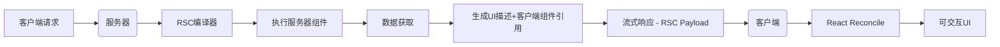

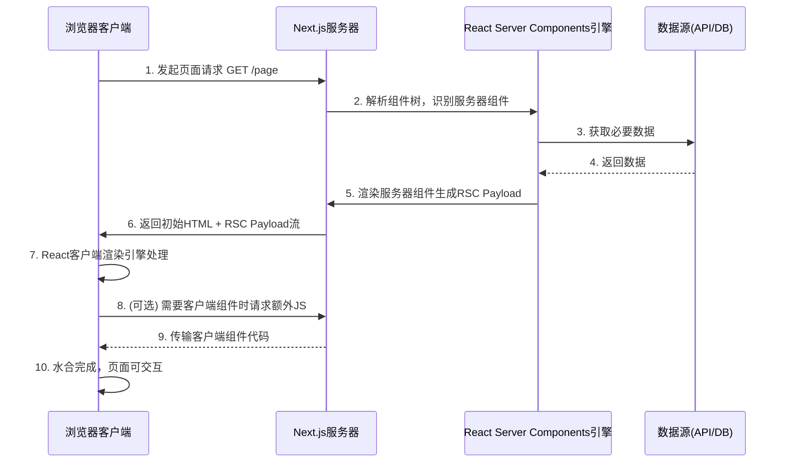

- 会有服务器组件和客户端组件，其中服务器组件会执行后，会生成特殊 JSON 结构（RSC Payload），通过**特殊格式的二进制流**传输，
- 这个 JSON 结构：
  - 渲染后的 UI 结构描述
  - 客户端组件占位符引用
  - 序列化的 props 数据
  - 水合指令
- 服务器可分段发送渲染结果，客户端逐步呈现可见内容。性能提升在 64%～ 75%之间。

### 3. 渲染流程：

1. **服务器端渲染**：
   - React 在服务器上执行服务器组件
   - 组件直接访问数据源（数据库、文件系统等）
   - 生成 UI 的轻量级描述（React Flight 协议）
2. **客户端处理**：
   - 接收序列化的 UI 描述
   - 与客户端组件无缝集成
   - 保持交互性

### 4. 缺陷

1. **无交互性**：服务器组件不能使用状态或效果
   - 因为是服务端渲染的，所以没有生命周期，也就不能使用 useEffect、window.location、useState
2. **props 限制**：传递给服务端组件的 props 必须可序列化
   - 比如 props 中传递函数，函数不能 json 化，所以不能传递
   - 服务器组件也不能作为 props 传递
3. **上下文访问**：服务器组件不能使用 React Context
   - **服务器组件不能使用 useState 或其他状态管理 Hook**
   - **服务器组件只在服务端执行**：它们运行在 Node.js 环境中，而不是浏览器中
   - **无持久化状态**：服务器处理完请求后即释放资源，无法维护组件状态
   - **无浏览器 API**：无法访问 DOM、事件系统等浏览器特有功能
   - 服务器组件所做的事情就是生成一个 UI 描述的 JSON。
4. **库兼容性**：部分第三方库可能需要适配
5. **学习曲线**：需要理解新的开发模式

### 5. 性能影响

使用 RSC 的典型性能提升：

1. **包大小减少**：高达 30-70% 的 JavaScript 减少
2. **TTFB 降低**：减少客户端-服务器往返次数
3. **FCP 提升**：更快的内容绘制
4. **交互时间优化**：更少的主线程工作

## 8. SSR 的缺点

1.  SSR 的数据获取必须在组件渲染之前
2.  组件的 JavaScript 必须先加载到客户端，才能开始水合
3.  所有组件必须先水合，然后才能跟其中任意一个组件交互

可以看出 SSR 这种技术“大开大合”，加载整个页面的数据，加载整个页面的 JavaScript，水合整个页面，还必须按此顺序串行执行。如果有某些部分慢了，都会导致整体效率降低。

此外，SSR 只用于页面的初始化加载，对于后续的交互、页面更新、数据更改，SSR 并无作用。

## 9. 什么是 Hydration 水合

**水合（Hydration）** 是指在客户端（浏览器）将静态 HTML 内容激活为完全交互式用户界面的过程

1. **初始状态**：服务器已经渲染了应用的初始 HTML，并将其发送到浏览器

2. **浏览器渲染**：浏览器立即显示静态 HTML（称为“脱水”状态）

3. **JavaScript 加载**：浏览器下载并执行应用的 JavaScript 包

4. 水合过程

   ：JavaScript 框架（如 React）：

   - 检查现有 DOM 结构
   - 将事件监听器附加到 DOM 元素
   - 初始化组件的内部状态
   - 建立虚拟 DOM 树与真实 DOM 之间的关联

5. **完成激活**：页面从静态内容转变为完全交互式应用

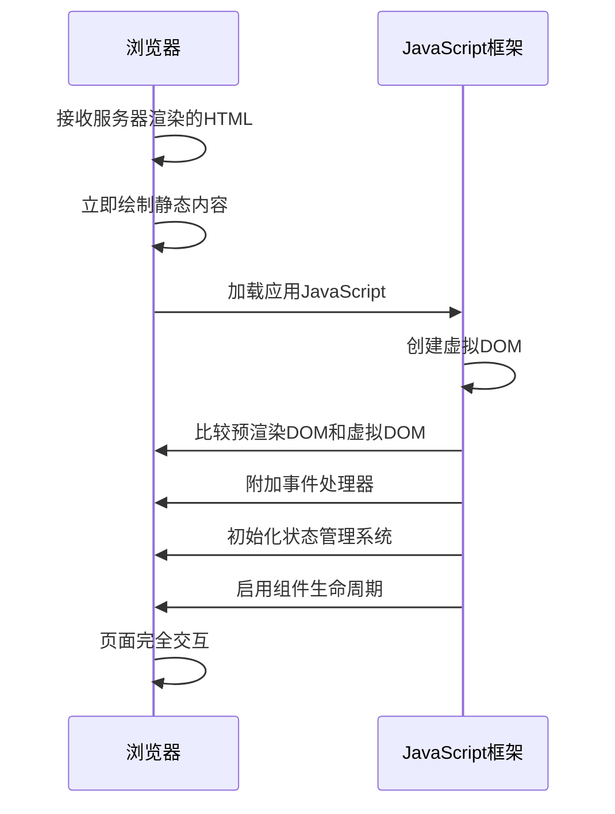

```js
// 伪代码：React中的水合实现
function hydrate(rootNode) {
  // 1. 匹配静态DOM和组件树
  const vdom = createVDOMFromComponents();
  const staticDOM = rootNode.querySelector("#app-content");

  // 2. 节点匹配和关联
  reconcileTree(staticDOM, vdom);

  // 3. 绑定事件处理
  bindEventListeners(rootNode);

  // 4. 初始化组件状态
  initializeComponentStates();

  // 5. 触发生命周期钩子
  callComponentDidMount();

  // 6. 标记水合完成
  setIsHydrated(true);
}
```

## 10. RSC 与 SSR

- RSC 和 SSR 非常相似，都发生在服务端，都涉及到渲染，目的都是更快的呈现内容。但实际上，这两个技术概念是相互独立的。RSC 和 SSR 既可以各自单独使用，又可以搭配在一起使用（搭配在一起使用的时候是互补的）。
- Server-side Rendering 的重点在于 **Rendering**，React Server Components 的重点在于 **Components**。
- RSC 提供了更细粒度的组件渲染方式，可以在组件中直接获取数据，而非像 Next.js v12 中的 SSR 顶层获取数据。RSC 在服务端进行渲染，组件依赖的代码不会打包到 bundle 中，而 SSR 需要将组件的所有依赖都打包到 bundle 中。
  - 总结：SSR 渲染是顶层获取数据，然后返回一个 html。而 RSC 是一个服务组件，当被需要的时候，进行请求得到 RSC Payload 再渲染到页面上。
- SSR 是在服务端将组件渲染成 HTML 发送给客户端，而 RSC 是将组件渲染成一种特殊的格式，我们称之为 RSC Payload。这个 RSC Payload 的渲染是在服务端，但不会一开始就返回给客户端，而是在客户端请求相关组件的时候才返回给客户端，RSC Payload 会包含组件渲染后的数据和样式，客户端收到 RSC Payload 后会重建 React 树，修改页面 DOM。

## 11. 传统 SSR

1.  服务端获取所有数据
2.  服务端渲染 HTML
3.  将页面的 HTML、CSS、JavaScript 发送到客户端
4.  使用 HTML 和 CSS 生成不可交互的用户界面（non-interactive UI）
5.  React 对用户界面进行水合（hydrate），使其可交互（interactive UI）

## 12. 性能指标

1. **TTFB (Time to First Byte)**: 从浏览器发起请求到接收到服务器响应的第一个字节的时间。它反映了服务器的响应速度和网络延迟。
2. **FCP (First Contentful Paint)**: 浏览器首次渲染任何文本、图像（包括背景图）、非白色的 canvas 或 SVG 的时间点。这个指标表示用户首次看到页面内容的时间。
3. **TTI (Time to Interactive)**: 页面变得可交互的时间。即页面已经完全渲染，可以可靠地响应用户输入（如点击按钮、输入表单等）。具体来说，TTI 是指最后一个长任务（long task）完成后的时间点，并且随后有 5 秒的安静窗口（没有长任务且没有超过 2 个正在进行的网络请求）。
4. **TBT (Total Blocking Time)**: 总阻塞时间，是指 FCP（首次内容绘制）到 TTI（可交互时间）之间，所有长任务（执行时间超过 50ms 的任务）中阻塞时间的总和。阻塞时间是指每个长任务中超过 50ms 的部分。例如，一个 70ms 的任务，其阻塞时间为 20ms（70-50=20）。TBT 反映了页面主线程被阻塞而无法响应用户输入的总时间。

- TTFB -> FCP -> TTI
- 请求时间 -> 渲染时间 -> 可交互时间
- TBT 指的是 FCB 到 TTI 的时间

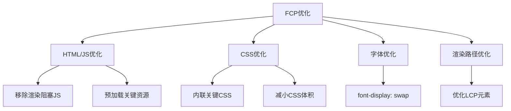

## 13. Suspense

- #### 使用：

```jsx
<Suspense fallback={ fallback UI 组件}>
	<动态组件 />
</Suspense>
```

- #### 概念

React Suspense 是一种处理**异步操作**（如数据获取、代码分割等）的机制，它允许组件在等待数据时"暂停"渲染，同时显示备用的加载状态。Suspense 的核心思想是声明式加载状态管理，提升了开发体验和用户体验。

大白话：react 的高阶组件吧，用来在异步加载组件的时候，显示加载页面

- #### 核心机制：暂停渲染

Suspense 通过以下机制工作：

1. **捕获异常**：当组件抛出 Promise 时
2. **暂停渲染**：React 暂停当前组件树的渲染
3. **查找边界**：向上查找最近的 `<Suspense>` 组件
4. **显示 fallback**：显示指定的加载状态
5. **等待解决**：等待 Promise 解决
6. **继续渲染**：重新尝试渲染原组件树

- Suspense 的 fallback 是会等待所有子组件都加载完成，才会显示。

nextJs 中如何处理 Suspense：

- `Transfer-Encoding` 标头的值为 `chunked`，表示数据将以一系列分块的形式进行发送。（在新协议已经废弃了，但是在开发过程中还是能看到这个请求头）

> 分块传输编码（Chunked transfer encoding）是超文本传输协议（HTTP）中的一种数据传输机制，允许 HTTP 由网页服务器发送给客户端应用（ 通常是网页浏览器）的数据可以分成多个部分。分块传输编码只在 HTTP 协议 1.1 版本（HTTP/1.1）中提供。
>
> - **流式传输原生支持**：HTTP/2 的流（Stream）和 HTTP/3 的数据包（Packet）天然支持分块和优先级控制，无需显式声明 `Transfer-Encoding`。

|       **特性**       |     `Transfer-Encoding`      |        `Content-Encoding`        |
| :------------------: | :--------------------------: | :------------------------------: |
|     **作用对象**     |     消息主体（传输过程）     |       内容本身（数据格式）       |
|     **典型取值**     | `chunked`, `gzip`, `deflate` | `gzip`, `br` (Brotli), `deflate` |
| **是否改变数据内容** |  否（仅分块/转换传输格式）   |       是（压缩/解压数据）        |
|    **客户端处理**    |      自动解析分块/转换       |     需解压内容（如 `gzip`）      |

- **Stream Server Rendering （流式渲染）**：注意和 SSR 不一样，SSR（Server-Side Render） 是服务端渲染。
  - Stream Server Render 解决了 SSR 渲染的第一个问题，就是数据获取必须在组件渲染之前。可以先渲染 Fallback UI ，等数据返回再渲染具体的组件内容。
  - 具体过程：
    1. Suspense 组件渲染 fallback UI ，然后与服务器建立连接
    2. **服务端流式传输**：通过 `Transfer-Encoding: chunked` 逐步发送后续渲染结果
    3. **服务端流式传输**：通过 `Transfer-Encoding: chunked` 逐步发送后续渲染结果
- Suspense 的优点
  - **性能优势**：更快的首屏渲染 + 更早的交互可能性
  - Selective Hydration（选择性水合）：React 根据用户交互决定水合的优先级
  - Streaming Server Rendering（流式渲染）：从服务器到客户端渐进式渲染 HTML
- Suspense + Streaming 的局限性
  - 将原本只能先获取数据、再渲染水合的传统 SSR 改为渐进式渲染水合
  - 但还有一些问题没有解决。就比如用户下载的 JavaScript 代码，该下载的代码还是没有少
    - RSC 可以优化这部分的问题

## 14. loading.js

`loading.js` 的实现原理是将 `page.js`和下面的 children 用 `<Suspense>` 包裹。因为`page.js`导出一个 async 函数，Suspense 得以捕获数据加载的 promise，借此实现了 loading 组件的关闭。
所以定义 loading.js。默认会被`<Suspense>`包裹。

所以一些路由切换的时候，可以使用 loading.js 实现优化。

## 15. 服务端组件

- 在 Next.js 中，组件默认就是服务端组件。

- 使用服务端渲染有很多好处：

  1.  数据获取：通常服务端环境（网络、性能等）更好，离数据源更近，在服务端获取数据会更快。通过减少数据加载时间以及客户端发出的请求数量来提高性能
  2.  安全：在服务端保留敏感数据和逻辑，不用担心暴露给客户端
  3.  缓存：服务端渲染的结果可以在后续的请求中复用，提高性能
  4.  bundle 大小：服务端组件的代码不会打包到 bundle 中，减少了 bundle 包的大小
  5.  初始页面加载和 FCP：服务端渲染生成 HTML，快速展示 UI
  6.  Streaming：服务端组件可以将渲染工作拆分为 chunks，并在准备就绪时将它们流式传输到客户端。用户可以更早看到页面的部分内容，而不必等待整个页面渲染完毕

  因为服务端组件的诸多好处，**在实际项目开发的时候，能使用服务端组件就尽可能使用服务端组件**。

- 虽然使用服务端组件有很多好处，但使用服务端组件也有一些限制，比如不能使用 useState 管理状态，不能使用浏览器的 API 等等。（因为是在服务区执行，并不会维护状态、也没有浏览器的一些 api，打印也只会出现在命令行、请求也是在服务端执行）

## 16. 客户端组件

- 使用客户端组件，你需要在文件顶部添加一个 `"use client"` 声明
- **注意：`"use client"`用于声明服务端和客户端组件模块之间的边界。当你在文件中定义了一个 `"use client"`，导入的其他模块包括子组件，都会被视为客户端 bundle 的一部分。**
- **服务端组件只会在服务端渲染，但客户端组件会在服务端渲染一次，然后在客户端渲染。**
  - 在客户端的组件事实上会在服务端先执行一次，为了提高第一次加载的速度，所以能够看到 客户端组件事实上打印的信息会在服务端显示，同时因为是客户端组件，所以打印也会在客户端执行的时候，显示一次。
- **服务端组件可以直接导入客户端组件，但客户端组件并不能导入服务端组件**
  - 一个是因为服务端组件可以使用一些 Node APi 进行操作，这些事无法在客户端执行的
  - 如果想在客户端组件中使用服务端组件，可以把服务端组件作为 props 传入客户端组件

## 17. 为什么服务端组件可以导入客户端，而客户端并不导入服务端组件？

关于服务端组件：

- 在 Next.js 中，Server Components 默认**不会被打包到客户端 bundle**
- 服务端组件功能（核心机制）：
  - **只在服务端执行**：Server Components 的代码仅在服务器端渲染（SSR）或构建时（SSG）运行，并且不会将它们的代码发送到客户端。这意味着，这些组件的代码不会包含在客户端的 JavaScript 包（bundle）中，从而减少了客户端需要下载的 JavaScript 体积，提高了性能。
  - **输出 HTML/JSON**：服务器将组件渲染结果转化为 **静态 HTML** 和 **轻量级 UI 描述**（RSC Payload），而非发送组件代码本身。
  - **客户端无代码**：浏览器只接收渲染结果，因此无需将组件代码打包到客户端 JavaScript 文件（bundle）中。
  - Next.js 的 Server Components 通过**服务端独占执行 + 输出序列化 UI** 的机制，确保其代码完全剥离于客户端 bundle。（就客户端接收到 对应的 Json 数据，然后再渲染成页面）
- 这样做的优势：
  - **减小客户端 Bundle 体积**：减少不必要的 JavaScript 下载量，提升页面加载速度。
  - **安全访问敏感数据**：数据库查询、API 密钥等逻辑不会暴露给客户端。
  - **高效数据获取**：直接在组件内使用 `async/await` 获取数据，无需额外 API 端点。
  - **自动代码分割**：依赖的第三方库仅保留在服务端，不增加客户端负担。

+ 使用服务端组件和客户端组件就可以解决这个问题，服务端组件的代码不会打包到客户端 bundle 中。渲染的时候，只有客户端组件需要进行水合，服务端组件无须水合。

### 1. 为什么服务端可以导入客户端组件？

Next.js 的 App Router 架构中，服务端组件可以导入客户端组件，这看似违反直觉（因为它们是不同环境），但实际上这是框架精心设计的核心特性。

- 请先看 第 18 个概念。无论是否客服端组件还是服务端组件，事实上都会在服务器上进行一次渲染，如果是服务端组件中导入客户端组件，那么，在服务器渲染客户端组件的时候，会返回对饮占位符数据给服务端组件进行渲染，然后在客户端涉及到客户端组件的时候，把对应 js 和 RSC Payload 发过去

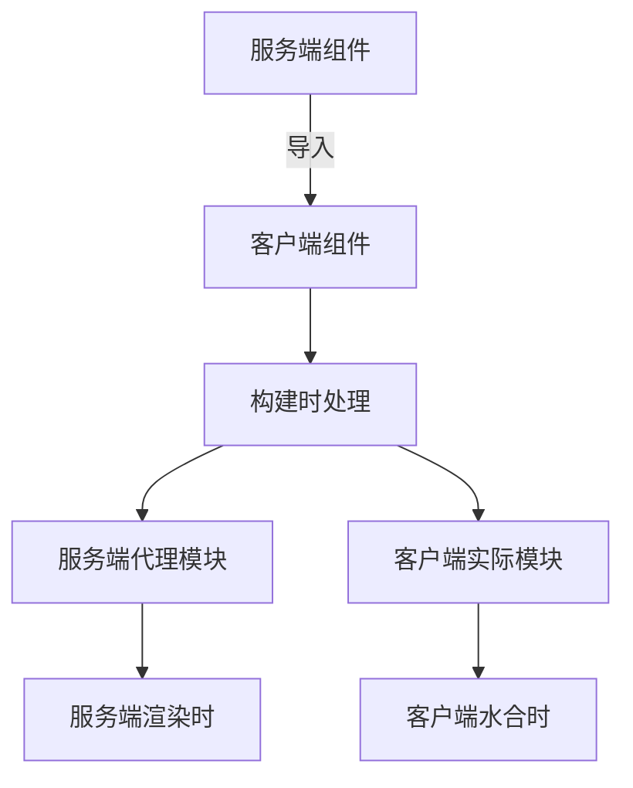

- 详细流程：

1. **构建阶段（编译时）**：

   - Next.js 编译器扫描所有组件
   - 识别带有 `"use client"` 指令的组件
   - 为每个客户端组件创建**双端入口**：
     - 服务端：生成轻量级代理组件
     - 客户端：保留完整实现

2. **服务端渲染时**：

   + 服务端引入客户端

   ```mermaid
   sequenceDiagram
       participant Server as 服务端环境
       participant Proxy as 客户端组件代理
       participant React as React 渲染器
   
       Server->>Proxy: 渲染客户端组件
       Proxy->>React: 返回特殊占位元素
       React->>Server: 生成包含占位符的 HTML
       Server->>Client: 发送 HTML + RSC Payload + JS文件
   ```

3. **客户端水合时**：

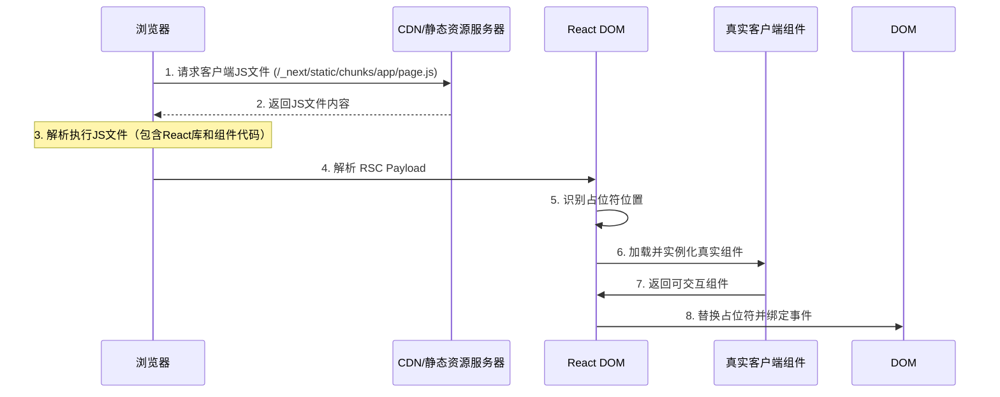

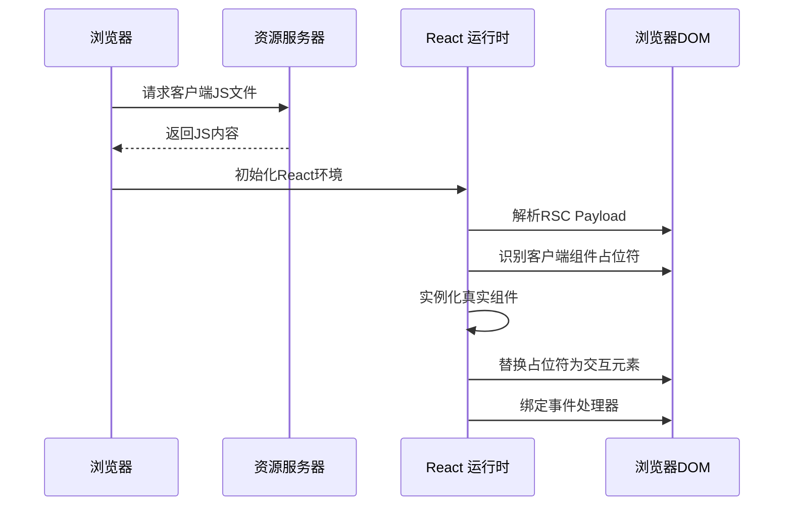

- 核心：当服务端组件导入客户端组件时，实际导入的是一个**特殊引用对象**，而不是真正的组件代码
- 所以：
  - 服务端**永远不会执行**客户端组件代码
  - 客户端组件代码只存在于客户端 bundle

### 2. 组件嵌套规则：

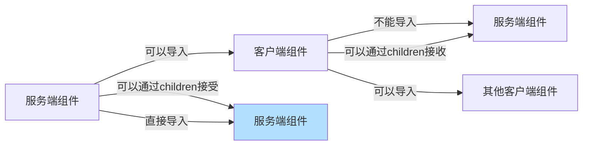

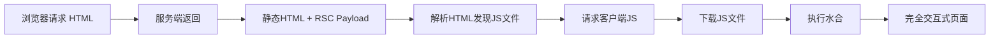

+ 服务端组件可以直接导入，或者children，两者都在服务端执行，没有环境隔离的问题。
+ 服务端组件可以导入客户端组件（在服务端渲染时，客户端组件会被渲染成静态HTML和占位符，然后在客户端水合）。
+ 客户端组件不能直接导入服务端组件（因为服务端组件的代码不在客户端，且可能包含服务端环境代码），但可以通过children的方式接收服务端组件的渲染结果。

### 3. 为什么服务端组件只能 props.children 传递？

+ 看另一个文件

## 18. 为什么客户端组件会打包成独立的 js 文件（chunk）？

- **核心原因：Hydration（注水）与交互性**

1. **服务端渲染(SSR)仅提供初始 HTML**
   - 当访问包含客户端组件的页面时，Next.js 确实会在服务端执行**首次渲染**，生成静态 HTML
   - 但这只是静态的快照，不包含任何交互逻辑（如点击事件、状态更新等）
2. **Hydration 的必要性**
   - 要使静态 HTML 变成可交互的界面，需要在客户端"激活"组件
   - Hydration 是 React 将事件处理程序和状态逻辑"附加"到服务端生成的 HTML 的过程
   - **这个过程需要完整的客户端组件代码**
3. **后续交互的维护**
   - 即使用户不进行页面跳转，组件内部的状态变化（如计数器、表单输入等）也需要客户端逻辑支持
   - 这些逻辑无法由服务端实时处理，必须由客户端 JavaScript 维护

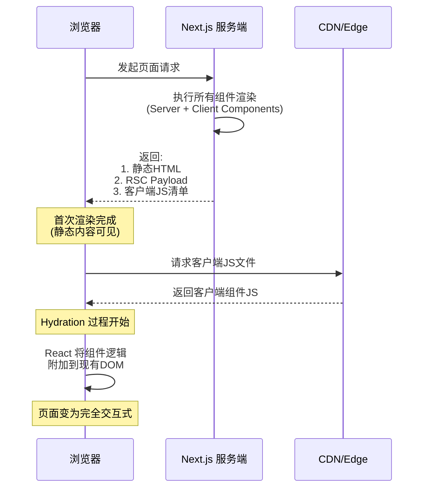

- 打包的时候，客户端组件会打包成独立的 js 文件，在请求客户端组件页面的时候，会经历过一次 服务端渲染（为了首屏加载更快）生成初始 HTML，但是整体 HTML 不具备交互能力，还需要请求该组件涉及的 js 代码。
  1. 所以客户端请求初始化 HTML 页面后，进行加载，
  2. 这个过程中遇到 script 标签，会异步下载 js 文件（包含 Client Components 的代码）
  3. 下载完成后，开始执行 React 水合。例如 HTML 原本 `<button>+1</button>`会绑定事件，变为`<button onclick="handleClick()">+1</>`

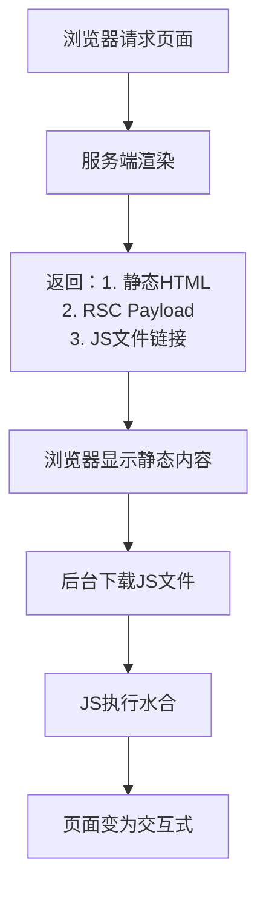

- 不难在这个过程中比较，因为服务端组件并不需要一些客户端能力，所以可以发现不需要下载独立的 js 文件，只是渲染 HTML。
- 但是如果出现客户端加载服务端组件怎么办？不可能 HTML 合并 HTML 吧？因此出现了 RSC Payload

## 19. RSC Payload 是什么？

- 在 Next.js 中，当使用 App Router 时，服务器组件（Server Components）不会将代码发送到客户端，而是将它们的渲染结果以一种特殊格式发送。这种特殊格式就是 RSC Payload（React Server Components Payload）。
- 什么是 RSC Payload？

  - RSC Payload 是一个轻量级的二进制数据流（在最新的实现中，它是以文本格式传输的，但结构紧凑），可以直接说 **结构化数据流**
    - 响应头包含：`Content-Type: text/x-component`
    - 响应体为二进制数据（具体看版本）
  - 服务器组件的渲染结果
  - 客户端组件的占位信息
  - 组件树结构关系
  - 序列化的 props 数据
  - 流式传输的分片标记

- **为什么需要 RSC Payload？（与传统 SSR 对比）**

| 传统 SSR                   | Next.js RSC 模式           |
| :------------------------- | :------------------------- |
| 返回完整 HTML 字符串       | 返回 HTML + RSC Payload    |
| 客户端需要下载整个页面结构 | 只下载动态部分的轻量级数据 |
| 水合时需要重建整个组件树   | 增量式水合，更高效         |
| 无组件级更新能力           | 支持组件级动态更新         |

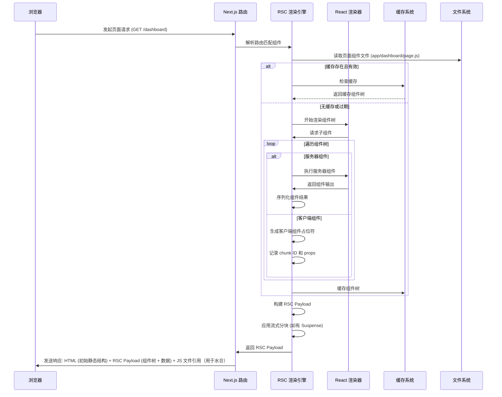

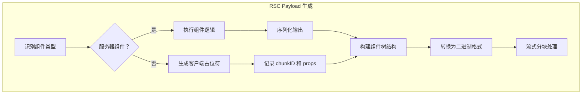

## 20. 请求一个客户端组件，加载哪些资源，分别作用是什么？

- 静态 HTML（初始可显示内容）
- RSC Payload（组件树 + 数据）
- 客户端 JS 文件引用（用于水合）

## 21. fetch缓存

+ 当在服务端获取数据的时候，有可能出现多个组件共用一个数据的情况。
+ nextJS 拓展了 fetch 的功能，添加了记忆缓存功能，相同的请求和参数（特定的请求，比如get），返回的数据会做缓存。

## 22. 其他一些技巧

+ 如果一些第三方库只能在客户端使用，但是没有定义 `"use client"` 声明，可以包一层

```js
'use client'
 
import { Carousel } from 'acme-carousel'
 
export default Carousel
```

## 23. 服务端渲染策略

# 一些概念

## 关于禁用缓存

- **禁用浏览器缓存和中间缓存的本质就是通过设置 `Cache-Control: 'no-store'` HTTP 头来实现的**。这是 HTTP 缓存控制机制中最严格、最彻底的禁用缓存指令。

- #### Fetch API

```js
fetch("https://api.example.com/data", {
  cache: "no-store", // 强制忽略缓存
});
```

- #### Axios

```js
axios.get("https://api.example.com/data", {
  headers: {
    "Cache-Control": "no-store", // 设置请求头
  },
});
```

- #### XMLHttpRequest

```js
const xhr = new XMLHttpRequest();
xhr.open("GET", "https://api.example.com/data");
xhr.setRequestHeader("Cache-Control", "no-store"); // 关键请求头
xhr.send();
```

- #### Node.js

```js
app.use((req, res, next) => {
  res.setHeader("Cache-Control", "no-store"); // 禁用缓存
  next();
});
```

- #### Next.js

```js
export default function handler(req, res) {
  res.setHeader("Cache-Control", "no-store");
  res.status(200).json({ data: "最新数据" });
}
```

- **`no-store` 的含义**：

  - 字面意思是"不要存储"
  - 强制所有缓存（包括浏览器缓存和所有中间代理/CDN 缓存）**不得存储**请求或响应的任何部分
  - 每次请求都必须直接向源服务器获取完整响应

- **与其他缓存指令的区别**：

  | 指令        | 作用                 | 是否禁用缓存  |
  | :---------- | :------------------- | :------------ |
  | `no-store`  | 完全禁止任何缓存存储 | ✅ 完全禁用   |
  | `no-cache`  | 可缓存但必须验证     | ❌ 不完全禁用 |
  | `private`   | 仅允许浏览器缓存     | ❌ 不完全禁用 |
  | `max-age=0` | 立即过期             | ❌ 不完全禁用 |

- 之前面试问到的一个问题：
  - 协商缓存的返回是 **304 Not Modified 状态码**
  - 强制缓存的返回是 200

# 问题

- 为什么服务端组件可以作为客户端组件的 props 传递，而不能直接导入？
