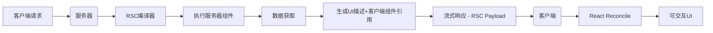
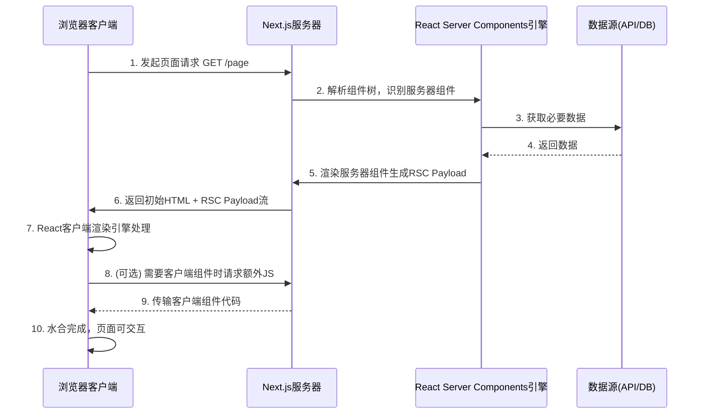
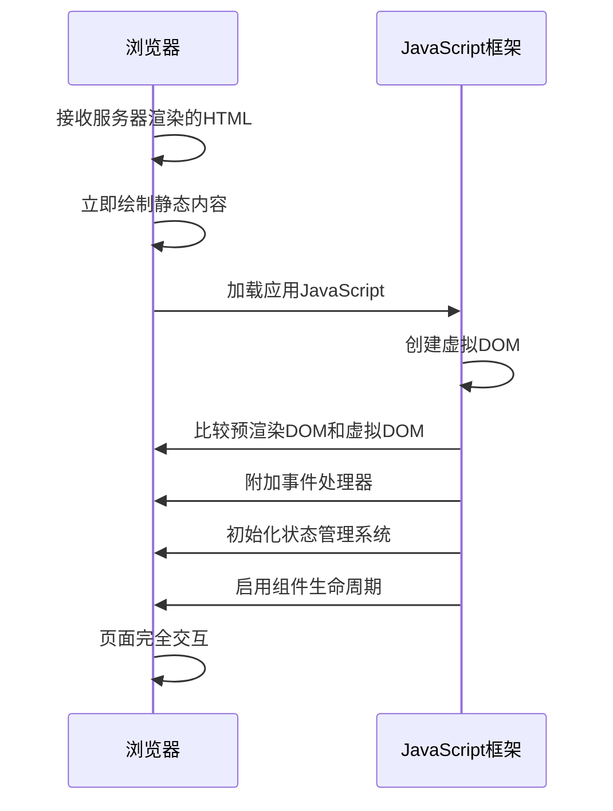

## 1. CSR、SSR、SSG、ISR ?

- CSR（Client-side Rendering）客户端渲染
- SSR（Server-side Rendering）服务端渲染
- SSG（Static Site Generation）静态站点生成
- ISR（Incremental Static Regeneration）增量静态再生

## 2. Next 实现 CSR？

1. 使用 useEffect

- 使用 useEffect 请求数据
- 需要标记这是一个客户端页面 通过`"use client";`

2. swr

- 标记 `"use client";`
- 使用 swr

## 3. Next 实现 SSR

- （了解）Page Router 使用 SSR，你需要导出一个名为 `getServerSideProps`的 async 函数。这个函数会在每次请求的时候被调用。返回的数据会通过组件的 props 属性传递给组件。（现在已经不提倡使用 Page Router，也不再建议使用 `getServerSideProps`）

+ 在nextJS中，默认请求回构建一个静态生成页面，在这个过程中没有使用到异步数据或者动态函数的时候，这时候的渲染方式更接近于SSG（静态站生成）
+ App router 方式中，可以使用异步组件 + fetch选项（需要显式设置 cache: 'no-store'）

#### ssr 和 动态渲染

1. **SSR 是服务器端渲染技术**：在服务器生成完整 HTML
   + **SSR（Server-Side Rendering，服务器端渲染）** 是一种网页渲染技术，核心特点是：**在服务器上生成完整的 HTML 页面，然后发送给浏览器**。
2. **动态渲染是 Next.js 的实现策略**：智能启用 SSR 的模式

## 4. NextJS 实现 SSG

+ 什么是SSG？
  + SSG 会在构建阶段，就将页面编译为静态的 HTML 文件

+ nextJS中当不需要获取数据时，默认使用的就是 SSG

## 5. NextJs 实现 ISR

+ NextJS 的核心功能，解决SSG，一旦生成不再改变的问题

1. **初始构建**：页面在构建时首次生成并作为静态页面部署
2. 请求时再生：
   - 当页面过期（或首次请求）时，Next.js 会在后台重新生成页面
   - 立即返回已缓存的旧版本
   - 生成完成后更新缓存
3. **下次请求**：用户获得新生成的页面

+ 具体实现方式，是通过配置 revalidate 表示缓存的过期时间。（具体怎么配置需要看文档）

## 6. 动态加载组件（Code Splitting）

- 通过 `dynamic` 函数延迟加载非关键组件，减少首屏 JavaScript 体积

```js
import dynamic from "next/dynamic";

const HeavyComponent = dynamic(() => import("../components/HeavyComponent"), {
  loading: () => <p>Loading...</p>,
  ssr: false,
});

export default function Home() {
  return <HeavyComponent />;
}
```

## 7. 什么是 React Server Components

### 1. 解决的核心问题

1. **Bundle 膨胀问题**：传统 React 必须将所有组件代码发送到客户端
2. **数据获取的次优化**：客户端常需要多次往返获取完整数据
3. **敏感信息暴露风险**：API密钥等可能被意外发送到客户端
4. **渲染水合开销**：客户端重复渲染服务器已渲染的内容

### 2. 工作原理和技术架构：






+ 会有服务器组件和客户端组件，其中服务器组件会执行后，会生成特殊JSON结构（RSC Payload），通过**特殊格式的二进制流**传输，
+ 这个 JSON 结构：
  + 渲染后的UI结构描述
  + 客户端组件占位符引用
  + 序列化的props数据
  + 水合指令
+ 服务器可分段发送渲染结果，客户端逐步呈现可见内容。性能提升在64%～75%之间。

### 3. 渲染流程：

1. **服务器端渲染**：
   - React 在服务器上执行服务器组件
   - 组件直接访问数据源（数据库、文件系统等）
   - 生成 UI 的轻量级描述（React Flight 协议）
2. **客户端处理**：
   - 接收序列化的 UI 描述
   - 与客户端组件无缝集成
   - 保持交互性

### 4. 缺陷

1. **无交互性**：服务器组件不能使用状态或效果
   + 因为是服务端渲染的，所以没有生命周期，也就不能使用useEffect、window.location、useState
2. **props 限制**：传递给服务端组件的 props 必须可序列化
   + 比如props中传递函数，函数不能json化，所以不能传递
   + 服务器组件也不能作为props传递
3. **上下文访问**：服务器组件不能使用 React Context
   + **服务器组件不能使用 useState 或其他状态管理 Hook**
   + **服务器组件只在服务端执行**：它们运行在 Node.js 环境中，而不是浏览器中
   + **无持久化状态**：服务器处理完请求后即释放资源，无法维护组件状态
   + **无浏览器 API**：无法访问 DOM、事件系统等浏览器特有功能
   + 服务器组件所做的事情就是生成一个UI描述的JSON。
4. **库兼容性**：部分第三方库可能需要适配
5. **学习曲线**：需要理解新的开发模式

### 5. 性能影响

使用 RSC 的典型性能提升：

1. **包大小减少**：高达 30-70% 的 JavaScript 减少
2. **TTFB 降低**：减少客户端-服务器往返次数
3. **FCP 提升**：更快的内容绘制
4. **交互时间优化**：更少的主线程工作

## 8. SSR的缺点

1.  SSR 的数据获取必须在组件渲染之前
2.  组件的 JavaScript 必须先加载到客户端，才能开始水合
3.  所有组件必须先水合，然后才能跟其中任意一个组件交互

可以看出 SSR 这种技术“大开大合”，加载整个页面的数据，加载整个页面的 JavaScript，水合整个页面，还必须按此顺序串行执行。如果有某些部分慢了，都会导致整体效率降低。

此外，SSR 只用于页面的初始化加载，对于后续的交互、页面更新、数据更改，SSR 并无作用。

## 9. 什么是 Hydration 水合

**水合（Hydration）** 是指在客户端（浏览器）将静态HTML内容激活为完全交互式用户界面的过程

1. **初始状态**：服务器已经渲染了应用的初始HTML，并将其发送到浏览器

2. **浏览器渲染**：浏览器立即显示静态HTML（称为“脱水”状态）

3. **JavaScript加载**：浏览器下载并执行应用的JavaScript包

4. 

   水合过程

   ：JavaScript框架（如React）：

   - 检查现有DOM结构
   - 将事件监听器附加到DOM元素
   - 初始化组件的内部状态
   - 建立虚拟DOM树与真实DOM之间的关联

5. **完成激活**：页面从静态内容转变为完全交互式应用



```js
// 伪代码：React中的水合实现
function hydrate(rootNode) {
  // 1. 匹配静态DOM和组件树
  const vdom = createVDOMFromComponents();
  const staticDOM = rootNode.querySelector('#app-content');
  
  // 2. 节点匹配和关联
  reconcileTree(staticDOM, vdom);
  
  // 3. 绑定事件处理
  bindEventListeners(rootNode);
  
  // 4. 初始化组件状态
  initializeComponentStates();
  
  // 5. 触发生命周期钩子
  callComponentDidMount();
  
  // 6. 标记水合完成
  setIsHydrated(true);
}
```

## 10. RSC 与 SSR

+ RSC 和 SSR 非常相似，都发生在服务端，都涉及到渲染，目的都是更快的呈现内容。但实际上，这两个技术概念是相互独立的。RSC 和 SSR 既可以各自单独使用，又可以搭配在一起使用（搭配在一起使用的时候是互补的）。
+ Server-side Rendering 的重点在于 **Rendering**，React Server Components 的重点在于 **Components**。
+ RSC 提供了更细粒度的组件渲染方式，可以在组件中直接获取数据，而非像 Next.js v12 中的 SSR 顶层获取数据。RSC 在服务端进行渲染，组件依赖的代码不会打包到 bundle 中，而 SSR 需要将组件的所有依赖都打包到 bundle 中。
  + 总结：SSR 渲染是顶层获取数据，然后返回一个html。而RSC是一个服务组件，当被需要的时候，进行请求得到 RSC Payload 再渲染到页面上。
+ SSR 是在服务端将组件渲染成 HTML 发送给客户端，而 RSC 是将组件渲染成一种特殊的格式，我们称之为 RSC Payload。这个 RSC Payload 的渲染是在服务端，但不会一开始就返回给客户端，而是在客户端请求相关组件的时候才返回给客户端，RSC Payload 会包含组件渲染后的数据和样式，客户端收到 RSC Payload 后会重建 React 树，修改页面 DOM。

## 11. 传统 SSR

1.  服务端获取所有数据
2.  服务端渲染 HTML
3.  将页面的 HTML、CSS、JavaScript 发送到客户端
4.  使用 HTML 和 CSS 生成不可交互的用户界面（non-interactive UI）
5.  React 对用户界面进行水合（hydrate），使其可交互（interactive UI）

## 12. 性能指标

1. **TTFB (Time to First Byte)**: 从浏览器发起请求到接收到服务器响应的第一个字节的时间。它反映了服务器的响应速度和网络延迟。
2. **FCP (First Contentful Paint)**: 浏览器首次渲染任何文本、图像（包括背景图）、非白色的canvas或SVG的时间点。这个指标表示用户首次看到页面内容的时间。
3. **TTI (Time to Interactive)**: 页面变得可交互的时间。即页面已经完全渲染，可以可靠地响应用户输入（如点击按钮、输入表单等）。具体来说，TTI是指最后一个长任务（long task）完成后的时间点，并且随后有5秒的安静窗口（没有长任务且没有超过2个正在进行的网络请求）。
4. **TBT (Total Blocking Time)**: 总阻塞时间，是指FCP（首次内容绘制）到TTI（可交互时间）之间，所有长任务（执行时间超过50ms的任务）中阻塞时间的总和。阻塞时间是指每个长任务中超过50ms的部分。例如，一个70ms的任务，其阻塞时间为20ms（70-50=20）。TBT反映了页面主线程被阻塞而无法响应用户输入的总时间。

+ TTFB -> FCP -> TTI
+ 请求时间 -> 渲染时间 -> 可交互时间
+ TBT 指的是 FCB 到 TTI 的时间

```mermaid
Zgraph TD
    A[FCP优化] --> B[HTML/JS优化]
    A --> C[CSS优化]
    A --> D[字体优化]
    A --> E[渲染路径优化]
    
    B --> B1[移除渲染阻塞JS]
    B --> B2[预加载关键资源]
    C --> C1[内联关键CSS]
    C --> C2[减小CSS体积]
    D --> D1[font-display: swap]
    E --> E1[优化LCP元素]
```


# 一些概念

## 关于禁用缓存

- **禁用浏览器缓存和中间缓存的本质就是通过设置 `Cache-Control: 'no-store'` HTTP 头来实现的**。这是 HTTP 缓存控制机制中最严格、最彻底的禁用缓存指令。

- #### Fetch API

```js
fetch("https://api.example.com/data", {
  cache: "no-store", // 强制忽略缓存
});
```

- #### Axios

```js
axios.get("https://api.example.com/data", {
  headers: {
    "Cache-Control": "no-store", // 设置请求头
  },
});
```

- #### XMLHttpRequest

```js
const xhr = new XMLHttpRequest();
xhr.open("GET", "https://api.example.com/data");
xhr.setRequestHeader("Cache-Control", "no-store"); // 关键请求头
xhr.send();
```

- #### Node.js

```js
app.use((req, res, next) => {
  res.setHeader("Cache-Control", "no-store"); // 禁用缓存
  next();
});
```

- #### Next.js

```js
export default function handler(req, res) {
  res.setHeader("Cache-Control", "no-store");
  res.status(200).json({ data: "最新数据" });
}
```

- **`no-store` 的含义**：

  - 字面意思是"不要存储"
  - 强制所有缓存（包括浏览器缓存和所有中间代理/CDN 缓存）**不得存储**请求或响应的任何部分
  - 每次请求都必须直接向源服务器获取完整响应

- **与其他缓存指令的区别**：

  | 指令        | 作用                 | 是否禁用缓存  |
  | :---------- | :------------------- | :------------ |
  | `no-store`  | 完全禁止任何缓存存储 | ✅ 完全禁用   |
  | `no-cache`  | 可缓存但必须验证     | ❌ 不完全禁用 |
  | `private`   | 仅允许浏览器缓存     | ❌ 不完全禁用 |
  | `max-age=0` | 立即过期             | ❌ 不完全禁用 |

- 之前面试问到的一个问题：
  - 协商缓存的返回是 **304 Not Modified 状态码**
  - 强制缓存的返回是 200

# 问题

