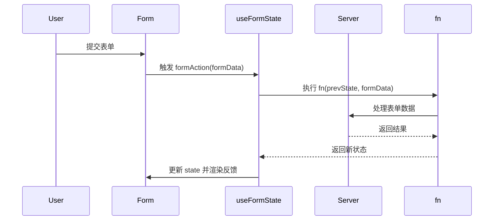

**Server Actions 是指在服务端执行的异步函数，它们可以在服务端和客户端组件中使用，以处理 Next.js 应用中的数据提交和更改。**

## 1. 基本用法

定义一个 Server Action 需要使用 React 的 ["use server"](https://react.dev/reference/react/use-server) 指令。按指令的定义位置分为两种用法：

1.  将 "use server" 放到一个 async 函数的顶部表示该函数为 Server Action（函数级别）
2.  将 "use server" 放到一个单独文件的顶部表示该文件导出的所有函数都是 Server Actions（模块级别）

**Server Actions 可以在服务端组件使用，也可以在客户端组件使用。**

+ 服务端组件支持 Server Actions 两种方式
+ 客户端组件只支持 模块级别

**而在具体使用上，虽然 Server Actions 常与 `<form>` 一起使用，但其实还可以在事件处理程序、useEffect、三方库、其他表单元素（如 `<button>`）中调用。**

## 2. 实现原理

当我们使用server action的时候，Next.js 会自动插入一个 `<input type="hidden">`，其值为 `$ACTION_ID_xxxxxxxx`，用于让服务端区分 Action（因为一个页面可能使用多个 Server Actions）。

```html
<input type="hidden" name="$ACTION_ID_40c31add034d7b138ef6e711820fd4b307010c2971">
```

当点击 Submit 的时候，触发表单提交，会发送一个 POST 请求到当前页面地址，请求方式为POST

请求会携带上面的name，和表单的值，然后接口响应的是 RSC Payload

1.  **Server Actions 背后使用的是 POST 请求方法**，请求当前页面地址，根据 \$ACTION\_ID 区分
2.  **Server Actions 与 Next.js 的缓存和重新验证架构集成**。调用 Action 时，Next.js 可以一次性返回更新的 UI 和新数据

## 3. 优点

1.  代码更简洁。你也不需要手动创建接口，而且 Server Actions 是函数，这意味着它们可以在应用程序的任意位置中复用。
2.  当结合 form 使用的时候，支持渐进式增强。也就是说，即使禁用 JavaScript，表单也可以正常提交：

## 4. 注意

1.  **Server Actions 的参数和返回值都必须是可序列化的**，简单的说，JSON.stringfiy 这个值不出错
2.  Server Actions 会继承使用的页面或者布局的运行时和路由段配置项，包括像 maxDuration 等字段

## 5. Form

### 5.1 useFormStatus（实验性）

```js
import { useFormStatus } from 'react-dom';

function SubmitButton() {
  const { pending, data, method, action } = useFormStatus();
  
  return (
    <button type="submit" disabled={pending}>
      {pending ? '提交中...' : '提交表单'}
    </button>
  );
}
```

+ **返回对象详解**

|    属性     |   类型   |           描述           |           示例值            |
| :---------: | :------: | :----------------------: | :-------------------------: |
| **pending** | boolean  |     表单是否正在提交     |      `true` / `false`       |
|  **data**   | FormData |  包含所有表单数据的对象  | `FormData { name: 'John' }` |
| **method**  |  string  |   表单使用的 HTTP 方法   |     `'get'` / `'post'`      |
| **action**  | function | 与表单关联的提交处理函数 |       `handleSubmit`        |

+ **注意事项**

1. **组件位置要求**：
   - 必须放在 `<form>` 元素的**直接子组件**中
   - 不能放在表单组件外部
2. **客户端组件**：
   - 使用 `useFormStatus` 的组件必须是客户端组件（使用 `'use client'` 指令）
3. **表单要求**：
   - 表单必须使用标准的 `action` 属性
   - **仅支持原生 HTML 表单**和 React 服务端操作
4. **状态范围**：
   - 只返回**最近父表单**的状态
   - 嵌套表单中需要谨慎使用

### 5.2 useFormState（不推荐使用）

+ useFormState 已经被改名字。实验性功能，变动比较大，不推荐使用

```js
import { useFormState } from 'react-dom';

// 基础结构
const [state, formAction] = useFormState(fn, initialState);
```

- **`fn`**: 表单提交处理函数，接收 `(state, formData)` 参数
- **`initialState`**: 表单状态初始值
- **返回**:
  - `state`: 当前表单状态
  - `formAction`: 处理后的表单提交函数，用于绑定到表单的 `action` 属性



## 6. Server Actions

要注意：

1.  获取提交的数据
2.  进行数据校验和错误处理
3.  重新验证数据
    + revalidatePath
    + revalidateTag
4.  错误处理

## 7. 乐观更新

### 7.1 useOptimistic（实验性）

略

## 8. 问题

### 1. 如何路由刷新